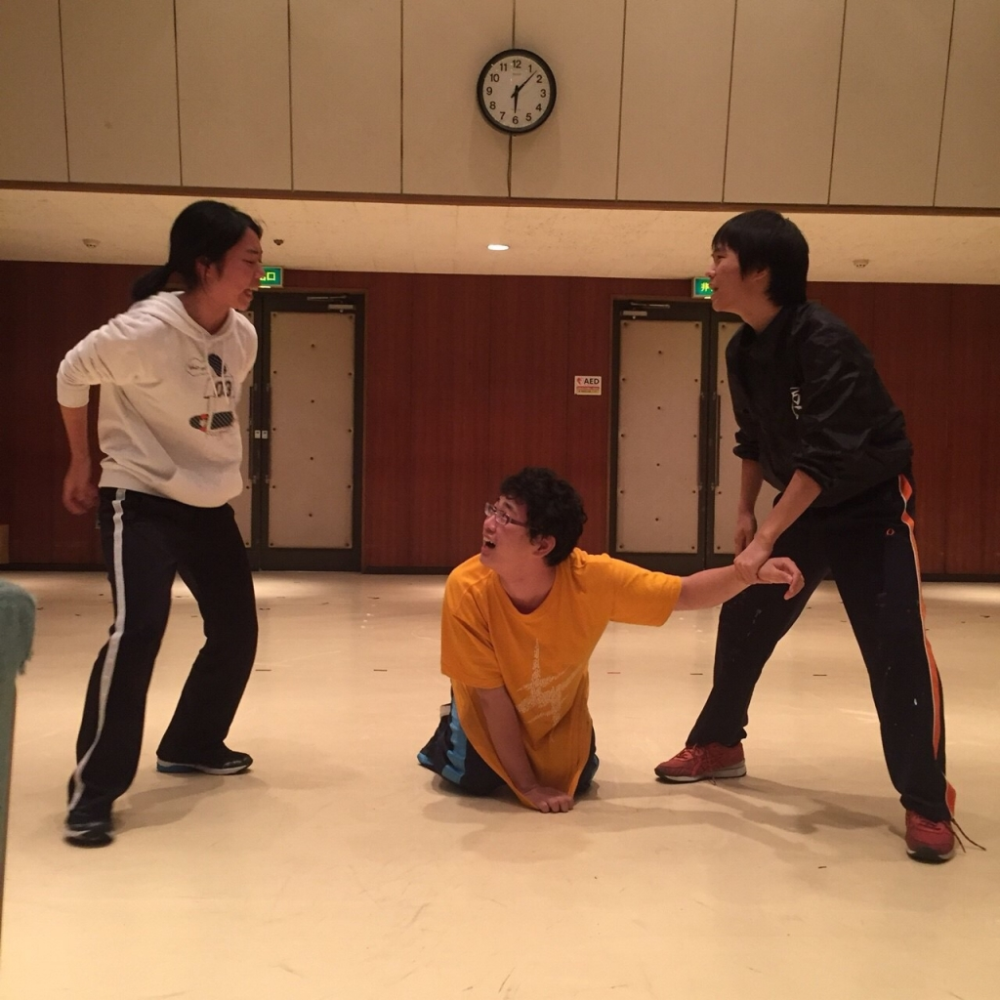

初めまして&お久しぶりです！３回生のこにたんです。今回は小道具と役者をやらせてもらっています！

謎の台風ラッシュがやってきましたね。今年の台風はどうも休日が好みの様子。今回は先週に比べればマシそうですが、傍迷惑なことには変わりなし。ですが我ら万絵巻はどんな時でも平常運転！今日も元気に稽古やっておりました！

本日は基礎練後、シーン回しをやっておりました。

で、基礎練なんですが…なんと20期生の出雲さんとキャメロンさんにエチュードに参加していただきました！お二人の変わらない元気さには現役生も圧倒されました。僕たちも負けていられません！

続けてシーン回し。役者間の話し合いも、動きを模索しつつ進んでおりました。話し合いの中では自分には無かった理外の発想が共演者から飛んでくるのは当たり前。これらをすんなり吸収できるスポンジの様な脳が欲しい今日この頃です。

写真はエチュードより。出てきて早々物理的に足が無くなっていたパズーです。

