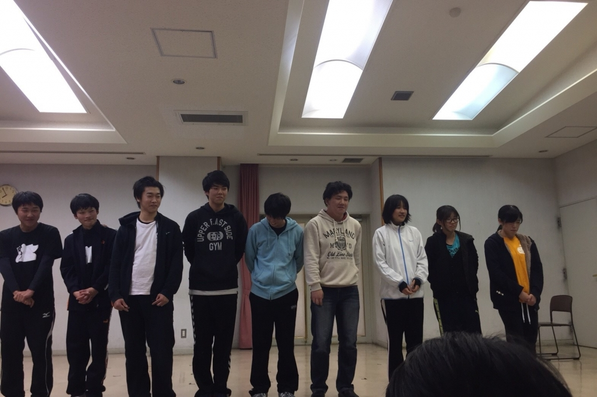

おはこんばちわ お久しぶりですノンベジ・JK・花夏流でふ！
秋以来のブログになりますね！初見さんも常連さんもゆっくりしていってください～

さて今回の卒業公演では私は役者として参加させていただきます！ 先輩方の花道を作るために精一杯頑張りますので楽しみに来て下さい！

この舞台の見所はですね圧倒的熱量です！今日の稽古ではドレスリハーサル(ドレリハ)をしたのですが、外で行なったので極寒の山で寒い寒いと言いながら稽古を行うのかと思いきや…溢れんばかりの熱量で！寒さなんて吹き飛ばしました！！その熱量を生み出している要因は数々の殺陣やダンス、そして何と言っても劇団員一同のやる気です！

その熱量感じ取れるのはこの『朧の森に棲む鬼』だけです！是非ご来場ください！足を運んでくれることを心よりお待ちしております！

p.s 稽古の合間に楽しい楽しい回生エチュードをしましたその時の一回生の写真です。
