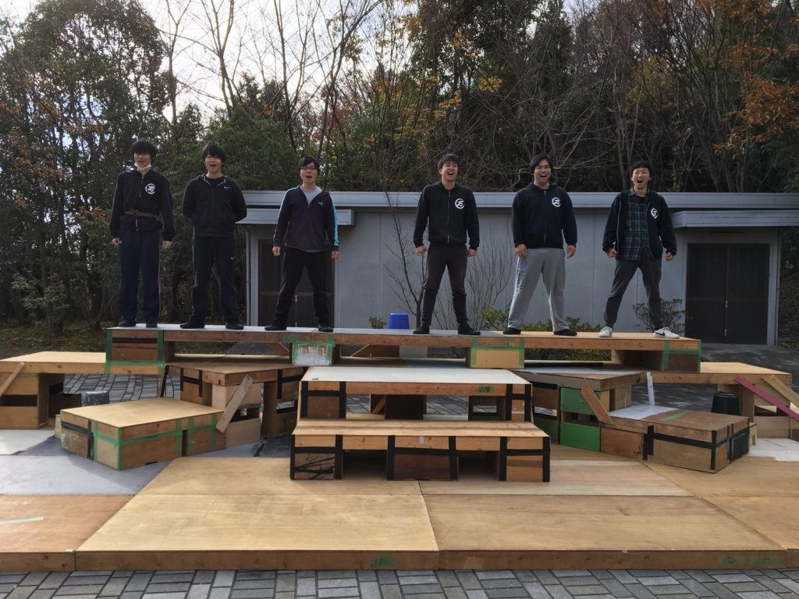

みなさんこんばんわ！

お久しぶりです！4回生のマキです！！
役者している4回生は僕からがスタートなのでドキドキです。(後から面白いことできる人が多いので...)

今日は１日稽古でした！
朝から建て込んで細かく詰めていくところを詰めていきました！
まだまだクオリティ高くしていきますよー( ´,\_ゝ\`)

朝から寒いのにも関わらずみんな早くから学校に来ててスゴいなって思います。(自分は半袖で外に出ながら)

みんなのスゴいところはなんやかんやでノリがええとこやと思います。
なんやかんややることもノリよく参加してくれますし、アホみたいなことしてもノってくれる人が多いです＼(^^)／
そういうところも演技に活かされてると思います( ´∀｀)

一回生も影響受けている子が多いのではないでしょうか？...楽しいところはどんどん影響を受けてほしいですね！

さて、そんなノリがよく楽しい人達が創る今回の公演！役者として感じる魅力はみんながよく言っている熱量と楽しい人ならではのユーモアなネタや会話、なによりいい公演にしたいという執念です。
そんな執念に、満ち満ちている公演を是非ともお足を運んで観に来ていただきたいです

明日も１日稽古があるのでそろそろここでお暇させていただこうと思います。
なかなかハードですけど楽しんだもの勝ちですね！！

ではでは
公演に来ていただけるかたは゛お待ちしております゛
そうでない方は゛ごきげんよう(\*´∀\`)♪゛

以上マキからでした！！

ps. 写真はめちゃキレイに集まってる謎の６人組です
勇者のパーティーみたいかもしれないですね(笑)
どんなことを話しているのか想像してみるのも面白いかも...！？
