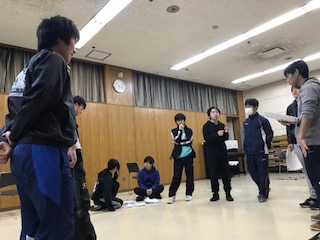

こんばんは、2回生の時雨です

ふと本番までの残り日数を数えるとなんと12日。
もうそんなに経ったのかと驚いて変な声が出てしまいました。
そして残り12日ともなるともう、稽古も大詰です。ひたすら作って演っては修正の毎日です。

今回初めてパフォーマンスの振り付けを担当させて頂いたんですが、めっちゃ楽しかったです！
みんな頑張って練習中なので是非お楽しみに……。
他にも舞台美術のデザインを担当させて頂いたり初めてのことが多いんですけど舞台を作るのって難しいけど楽しいですね。後輩とわいわい話しながら作りました！
中々凝ったデザインになってますのでそちらもご賞味ください ^ - ^

新人発表公演『ベッキーの憂鬱』18日19日ワムホールにて、お待ちしてます

P.S. 今日初めてラクレットなるものを食べました。あれは見てて楽しいしとても美味しいですね……
