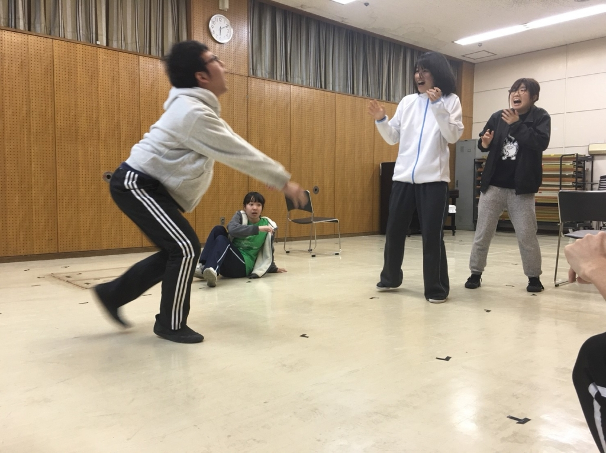

おほほ。ご機嫌麗しゅう。
ジンジャー紅でございますわ。

みなさま最近いかがお過ごしかしら？
わたくしはとっても元気。おほほ。
お食事は美味ですし、お空は綺麗ですし、稽古は楽しいので毎日はっぴ～って感じですのよ。

これは最近の稽古で改めて感じていることなのですけれど、マイムで相手に伝えるって本当に難しいのね。英語を話している時のような難しさがありますわね。

わたくしはどちらかと言えばお台本を読むのを好んでいましたのでマイムは慣れなくて大変ですわ。
でもそれだけ楽しくて素敵ですのよ。自分の体を大きく使って、相手に伝わった時の喜びは何にも変えられない物だとわたくしは思っていますの。

おほほ。

いい感じに着地点を見失ってきたところでお別れにしようと思いますわ。それでは、お嬢様言葉にしたら文字数稼げるんじゃねぇのかなという安易な発想に従ったジンジャー紅でした。みなさまごきげんよう。

写真はサイレントエチュードで何…何これ？何？ってなってるところに飛び込んできたスキャ姉さんですわ。ちょっとバレーボール選手みたいですわね。
