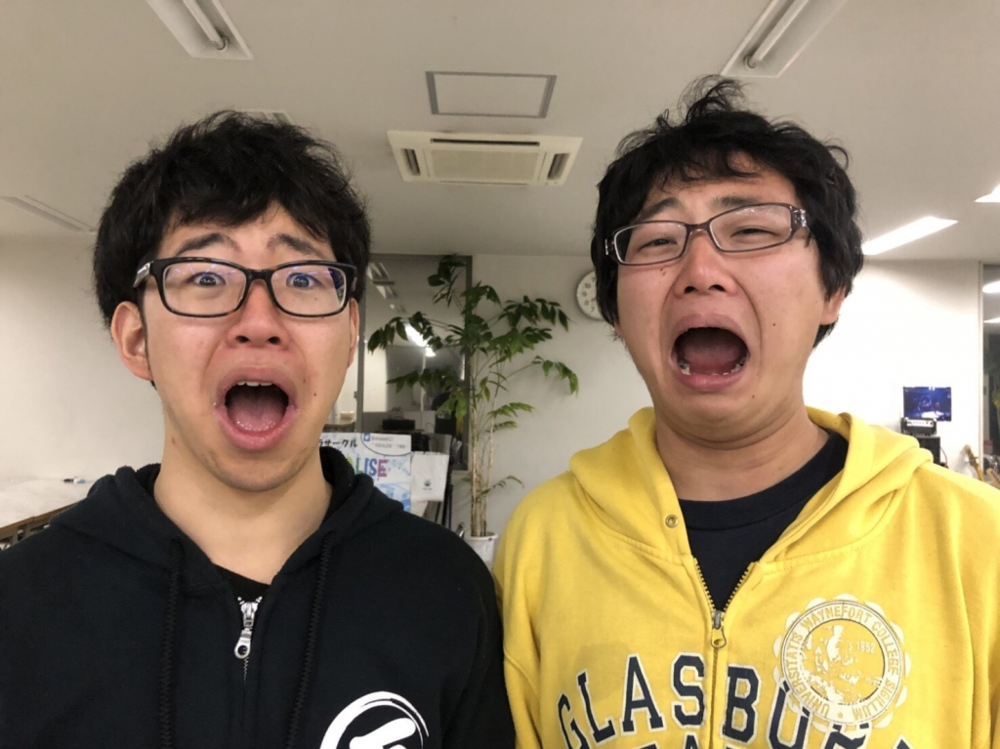

※タイトルは後々回収します。

どうも！こんにちは！！

新歓に引き続き役者させていただく、パズーです！！！

TC公演、、、

一般向けの公演の中で一番自由度が高い公演だと4回生になって初めて気づきました…

何故かって？

それは、実力派揃いの役者！

見に来るお客さんは学内でいつも一緒に過ごしている学生、又はメンバーの知人！

最後に、無料公演ということもあり、変なプレッシャー（自分だけかも）がかからない！！

ということは、超！絶！遊！べ！る！

からです！！！

これはもうやるっきゃないッスよ～！

って感じでTC公演頑張っていきます！！

本番お楽しみに！！

↓ここからは先は見なくて大丈夫です。

～～～～～～～～～～～～～～～～～～～

ぱずーの日常「あるひのわかれ」

パズー「よし、散髪に行ってから稽古行くか！」

その一言が悲劇の始まりだった。

その日は前日の雨なんかなかったかのようないい天気と、

この頭の上に雲の如くのしかかる天然パーマの髪の毛とおさらばできる晴れやかな気持ちで扉を開き、

自転車の空気が結構抜けていたため補充をし、家を出た。

その時刻、16時30分。稽古開始まで残り1時間と30分…

ーーーーーーーーーーーー

（その時のパズーの計算）

家→散髪屋 10分

散髪時間 20分

散髪屋→地元駅 20分

地元駅→高槻駅 10分

高槻駅→学校 30分

                      計 1時間30分

ーーーーーーーーーーーー

しっかり、電車、バスのダイヤを調べ準備万端！！

しかし、時に神様は試練を与える。

全身に風を纏い、鼻歌混じりの上機嫌のパズー。

散髪屋までの道中、

パーン！！！！！

という、銃声にも似た音が背後から聞こえてきた。

びっくりしつつ後方確認するも何も無い。

首を傾げながらペダルを漕ぐ。

すると、何か異変を感じる。

金属が擦れる音、強く漕いでも変化しないスピード。

そう、自転車がパンクしたのだ。

これはまずい、パズーの歯車が狂う。

その時刻、16時38分。

ーーーーーーーーーーーー

（再計算）

散髪屋→家 15分

家→地元駅 30分

地元駅→高槻駅 10分

高槻駅→学校 30分

                      計1時間25分

ーーーーーーーーーーーー

が、これは電車、バスの繋ぎの時間の計算を入れると間に合わなく、あえなく演出に一報いれると、間に合わなくても走るかと稽古場に向かいました。

さらば、自転車、さらば、時間。さらば、晴れやかだった気分。

さらば出来なかった、この髪をたなびかせ今日も稽古頑張るぞの気持ちでいっぱいのパズーでした。

                          （完）

ここから学ぶ教訓は、自転車のケアはしっかりしましょう！ではなく、もっと余裕の持った時間管理をすることです。

ということで、明日は自転車修理と散髪行ってきます。
