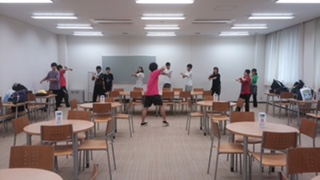

おはこんばんちわ！
ノンベジ・jk・花夏流です！

はじめての人は はじめまして ご存知の方は ありがとうございます～

今回のブログ内容に私が選ばれたのはですね、今日が僕の1番の仕事の見せ所だったからですかね～
なぜかというと秋公演『ひとんちでさよなら』では、私は衣装チーフ、振り付け、役者という３つの役職を兼任させてもらってます。とても光栄で胃に穴があきそうです！
とまぁこのように兼任しているのでパンフレットやチラシには私の名前がたくさんなわけで沢山の俺ガイルってわけですね～ sonic boomを打つわけで無かったのです。

さて話を戻しますと今回仕事の見せ所と言っていたのは本日の1日稽古ではダンスの振り写し等をしました！とってもエライまじエライ…
振り写しを終えたのですが本当に今日の稽古場は凄かったみんな踊り続けてました足パンパンになるほど踊ってましたまさか1日で完成形になるとは思ってなかった…役者さんたちのやる気がヤバイ凄すぎる。
あと振り付けするの初めてだったんだけど終わってよかった～あと2年連続で秋公演に関われてよかった～
そんなダンスをヤバイメンバーが踊ってくれるので是非見に来て欲しいです！

今回そのダンスが観れるのは9/29.9/30の秋公演のみです！楽しみにお待ちしております！

ではまた～
