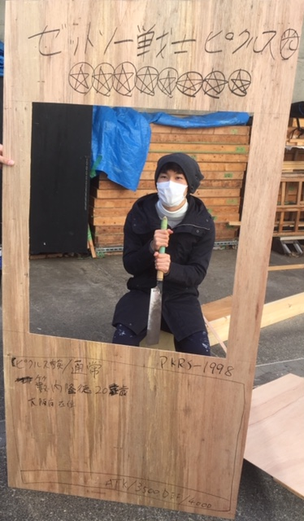

皆様こんにちは、デイビットです。
本日は成人式ですね
こういう僕も20歳になったらしいですね。今までの人生を振り返ってみると今まで思うようにならない事ばかりで、今日の数時間後や明日、明後日以降も思うようにならない事の連続だと思います。

でも、予期せぬ出来事の連続でこうしてみなさんに出会っているので、出会う一人一人の方々には感謝の気持ちを持って、接していきたいなと思っています。

そして、「これからの日本は君たちが背負って日本支えていく番だよ」こう言った言葉も最近よく耳にします。確かにこれからは僕たちが日本の社会を回していく番です。でも、実際、何をすれば回るの？って思います。
外資系の企業に入ること？トヨタ自動車に入ってたくさん車を生産していく？どれもこれも一部合って一部違っていると思います。その答えは今の僕には分かりません。

ただ、一つ日本を背負っていく立場としてこうした考えを持って考えなければならないそういう時期だと思います。

考えたくもない事、それも考える。自分の弱みを受け入れて、またそこから成長していきたいなーって思います。

写真はこれまでの話とは全く関係ありませんが、大道具作業の光景です。何資材を無駄にしているんだ！！って声もあがると思いますが、しっかりとした舞台美術へとここから生まれ変わります。

レモンキャンディ乞うご期待です！
