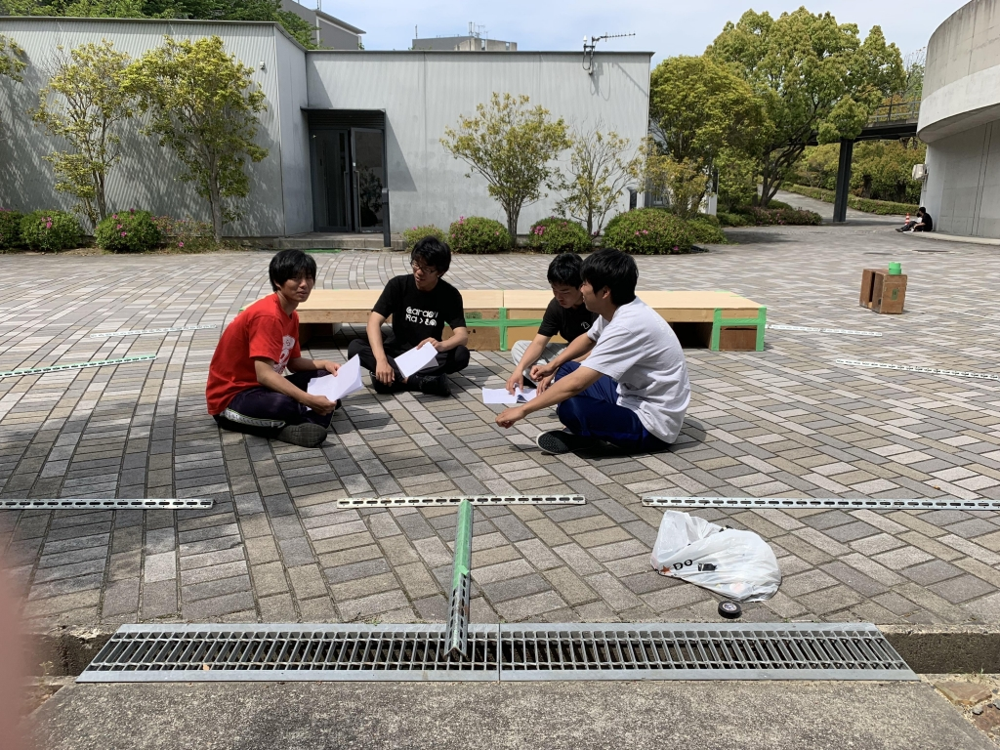

> 皆さんどうも、今回のブログは2回生のボスメタモンです。最近ヨーヨーで顎切りました。めっちゃめっちゃ痛かったですけど、さっきヨーヨーが肘にも衝突しました。楽しいです。初っ端からわけわらんこと書いてますね。知りません。
>
> 今回は音響チーフとして参加させて頂いてます！音響チーフをやるのは今回が2回目、オペは3回目なんですね。気づいたら結構やってるやん。僕はこの公演で様々なことに挑戦したいと思っています。今まで自分がやらなかったこと、やってこなかったこと、新しく挑戦したいこと…などに挑戦し、自分のもっと高めていければなぁ…なんて思ったり。演出と考えまくってプランも作っていってるんでまだまだプランも変わっていきそうですね。話してる最中雑談ばっかしてますけど笑。それに今回は役者さんが同期が多く、これからどれだけ役者として成長していくのかが実は楽しみなんですね。また横にあの照明チーフもいますし笑。もちろん苦悩することもいっぱいあります。ですが、これからどう壁を乗り越えていくか、その先に何があるかもこっそり気になっています。どんな結果であってもしっかり受け止めたいと思っています！すごく楽しみ！
>
> 本日は第1回通しをやりました。役者さんの人達の苦労や努力が少しづつ見えてきて、これからの稽古が楽しみになってきました。これらに音響効果を付けていくと何処まで変わるのか、これはやってみないとわかんないですねー。照明までも加わってくるとどれだけ変わってくんるんやろ。
>
> 以上最近とある先輩に知能指数を下げられまくってきているボスメタモンでした！うひょひょひょひょひょい！！！
>
> 
>
>
