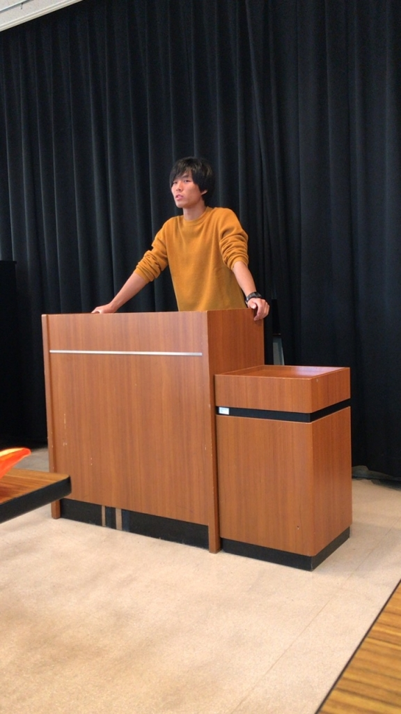

おはようございます、まるです！
卒公の稽古始まって一ヶ月と少し、本番まではすでに二週間をきってしまいました。よく歳を取れば取るほど時間が過ぎるのが早く感じるって言いますが、はやい、本当に早すぎます！！
そしてあと一年もすれば今度は僕たち24期の卒公………全然実感が湧かないです……

僕の今年の卒公の目標は「教えられる側から教える側の人間になる」です。僕自身それほど役者をやったことはありません。今回で4回目のはずです。役者経験が少ないので最初はみんな自分について来てくれるのかなってすごく心配でした。なんなら、未だにちゃんと教えられているのか不安ですが…。でも、後輩たちはとてもいい子ですごく話を聞いてくれるんですよね！とくにハルちゃんはすごく一生懸命に聞いたり考えたりしてくれるいい子なんですよね！
ありがとう！！

この卒公やっと先輩として動けるよう成長したんじゃないかなって思います！本当に感謝しかありません！

色んな人の成長が見られる卒公をぜひ見に来てください！！
