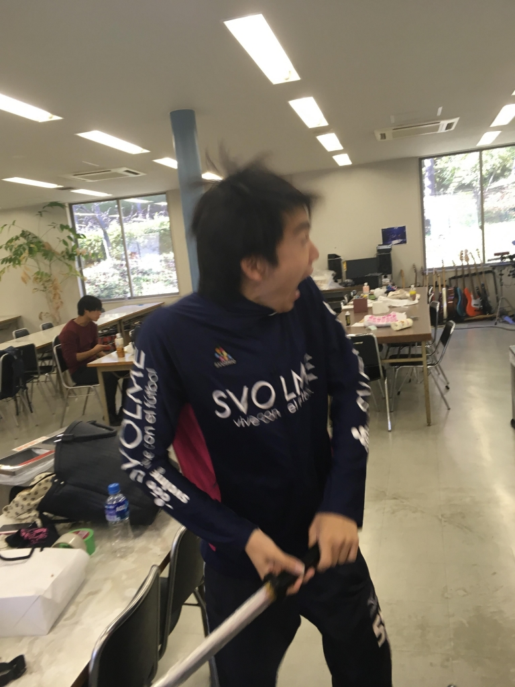

どーもー、１回生の真弓です！

タイトルは、僕が最近ハマっている某パークの某ライドの口上です。

本来はこれは「地球が誕生して……」みたいな壮大なテーマの口上として使われているのですが、自分はこれを聞くとある思いを馳せることがあります。例えば、この万絵巻を例にとってもそうです。自分たちは今現在、26期生として23期生の卒業公演の練習中で奮闘中ですが、これは単純計算でも、6×22＋5=137回目の公演になるんですね。とても長い歴史なんですよ。悠久の流れなんですよ。そんな100何回目の公演で1番よかったと思える劇は普通、お客さん・役者ともに各々違ってくるでしょう。しかし、自分はお客さんにとって今練習している公演がNo.1/137になれるようにと毎回意識して練習しています。この卒業公演も勿論長い歴史のNo.1になれるよう頑張りたいと思います！

そして具体的な練習の話をすると、今回は自分はアンサンブル(通称ES)として、この「撃鉄の子守唄」に関わらさせていただいています。6人で協力してありとあらゆる群衆を表現するという陰ながらも難易度の高いことをやっているんです。しかし、この役割のいいところは、比較的多人数で練習を行うため、それぞれがそれぞれの欠点、つまり「穴」を埋め合えるというところなんです！お互い切磋琢磨して成長していくのもいいことですが、何せ6人もいるので、役者1人に対しても色んな欠点が挙がって穴に穴に……とキリがないのもアンサンブルならではですね。果たしてあと1週間でどこまで仕上がるのか！ぜひぜひお楽しみに！

画像はオンオフのギャップが激しいでおなじみ、休憩中のハブられメタルくんです！！

