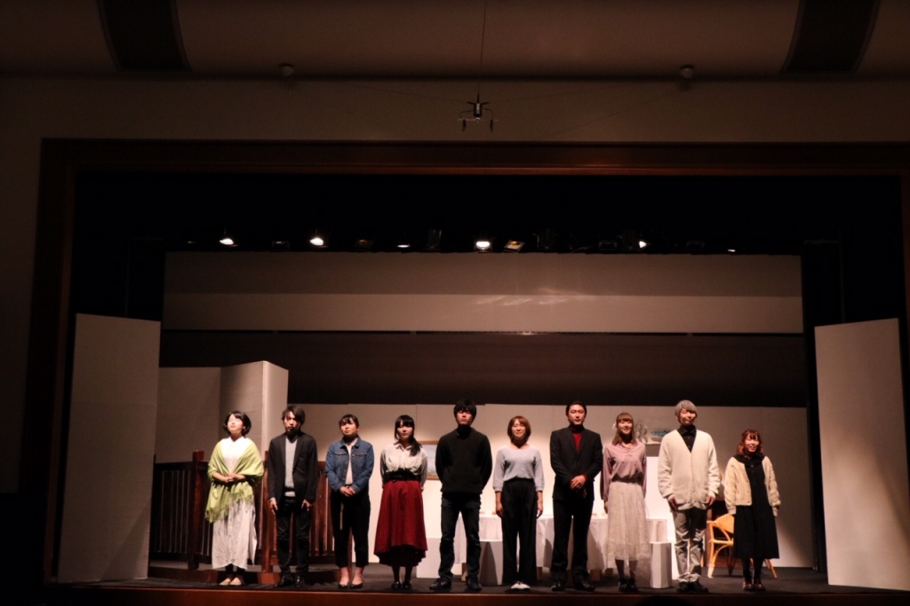

お疲れさまです、書記です。
昨日あげようと思ったら寝てました。すみません～～！！

早いもので新発ももう終わりですね。
2ヶ月くらいあったはずなんですが本当にあっという間でした。

この新発、考えて考えて台本と向き合って、役と向き合って、自分のクセと向き合って、自分の魅せ方と向き合って、セリフと向き合って、制作物と向き合って……それぞれがそれぞれに向き合い続けた期間でした。
私も演出と向き合って、しんどかったこと、後悔したこと、反省すべきことがたくさん出来ました。でも、それよりたくさんの学べたこと、得たこと、嬉しかったことが出来ました。演出やって良かったな～～～！！！他のみんなもこの公演でたくさんのことを得たと感じてくれていたら嬉しいですね。

また、どの役職にも役者にも、そして補佐にもたくさんのわがままを聞いてもらいました。演出ってそういうものなのかもしれませんが、関わってくれた方全員に感謝してます。ありがとう。今後の万絵巻での活動を通して少しずつお返しできたらと思います。

そして昨日は小屋入り2日目。1stでした。
小屋入りしてからも良くなってきてると感じますね。ハケから見守っていましたが皆すごいなぁと圧倒されてしまいました。どの公演もそうなんですが、舞台上にいる時はもちろん、ハケで人の演技を見ている時間も好きなんですよね。新発の舞台はハケから舞台上が見えるので楽しいです。

話が逸れてしまいました。

残されたあと1日、いっぱい考えて、いっぱい演じて、いっぱい足掻こうね。最後まで。

…前説噛まないように頑張ります。笑
