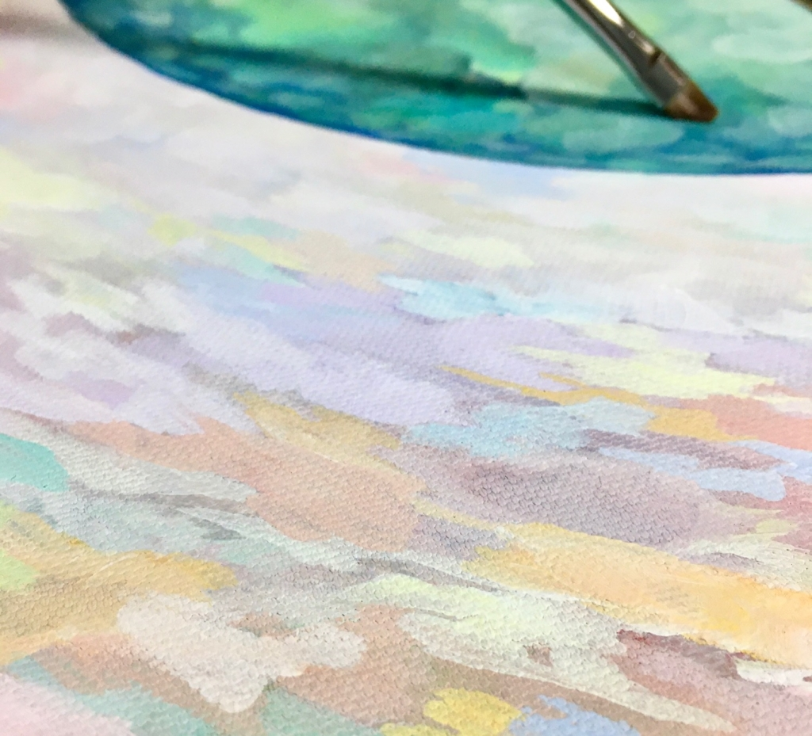

お疲れさまです、新歓2発目のブログになりますね書記です。
今回の公演では主に演出補佐・役者・広報チーフとして関わらせて頂いております！役目をいっぱいもらっちゃいました、大変だけどぜんぶ楽しい～～！！！

で、新歓公演の話をします。
去年の新歓公演、私は残念ながら途中からしか観れてないのですが、それでも万絵巻に興味をもつきっかけになりました。「大学の演劇ってこんなの出来んの、凄いな」と感動したのを覚えています。
そんなふうに次入ってくる新入生に、演劇サークル面白そう！と思わせる劇を作っていきたいですね。
あとは見てる人に伝わるくらい楽しんで演じれたらいいな～と思います。楽しそうであればあるほど魅力的になると思いますね。

そして私が作る広報物は割とほぼ手描きなのですが、今回も手描きです。
今回はキャンバスに絵の具で描いてます！全体的に淡い感じなので白色の絵の具だけ爆速で減ってます笑 久々のアナログになるんですがこれがめちゃくちゃ楽し～～！！！完成品をお楽しみに。

なんかずっと楽しんでるブログになっちゃいました、それではこのへんで。
