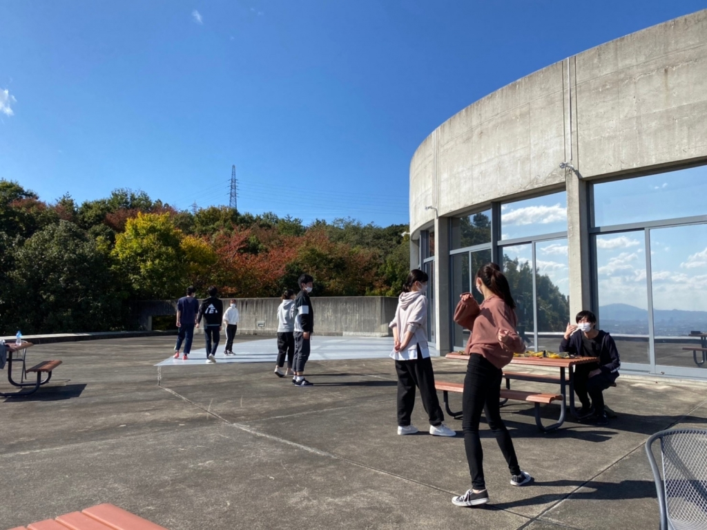

お疲れ様です！！！そしてお久しぶりです2回生の書記です！

みなさんいかがお過ごしでしょうか。私は連日のオープニングダンスの練習のおかげで全身が筋肉痛です。寝返りをうつのが1番しんどいです。
今回の公演ですが、私は主に役者と広報をやらせて貰ってます。そして去年に引き続き、手描きの広報物を作っています。演劇して絵を描いて演劇して…この学部に入ってこんな毎日を送ることになるとは思ってませんでした。芸術塗れの生活って良いですね めちゃくちゃ楽しいです。

……最近みんなブログ短くない？って思ってたんですけど、自分に回ってきて気が付きました。ブログを書く時間が本当に無いんですねこれ

ブログを書く暇がないほどやることいっぱいですから今回の公演もそれだけ作り込まれているということですね！本番が待ち遠しい一方で、これが現4回生との最後の公演になるのかと思うと本番が来て欲しくないと思ってしまいます。それでも時間は有限ですし来るものは来てしまうので楽しみながら走り抜けようと思います～ ぜひ見に来てくださいね！！！！！！！

写真は最近の稽古の様子です。よい天気！&#9728;&#65039;
