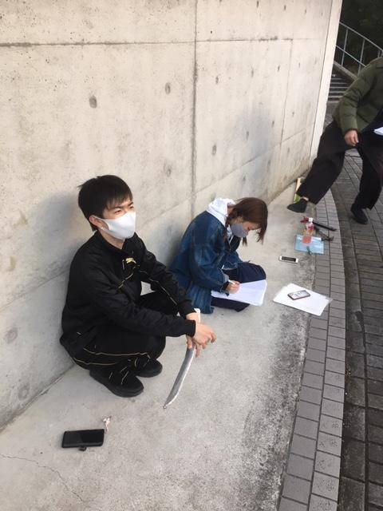

　お久しぶりです、最近全力でカッターナイフを踏みつけて左足が死ぬ程痛いナダルです。
今回のブログはちゃんと先に写真を見てから読む事をお勧めします

　「きぶくれ」と言う冬の季語が御座いますが、これは説明するまでもなく、寒威に耐え兼ねた人々が重ね着しすぎる事で熊のように、或いは芋虫のように丸々と膨れる様子を表したものであります。
　暦の上ではまだ、冬と言うには少し早いように思われる十一月ですが、行き交う人々は皆一様にコートなぞ着込んで、肩をちぢこませて歩いており、なるほど冬の到来も直ぐそこかと思う次第。かく云う私も、流石に重ね着しなければ歯の根も合わぬと箪笥から上着を一枚引き摺り出し大學へ向かう毎日です。
　とまれ、眼前に迫る冬に多くの人は何かしらの対処をなさっている事でしょう。何しろ、冬は寒いのですから。
　ですが、先日見かけた彼らは如何も私達とは様子が異なるようでした。そう、道端に蹲る孤児たちです。
　彼らの身なりはそれはもう酷いものでした。骨と皮ばかりになり今にも頽れんとする、その少年の瞳は虚空を写しておりだらりと下げたその両腕も相まって、何もかもを絶望した諦観の念を感じざるを得ませんでした。炭坑にでも働きに出ていたのでしょうか、せめてもの衛生具として小綺麗なマスクを付けさせられているのが一層、痛々しく感ぜられ、ある種の憐みさえ抱きそうになります。
　その影に隠れるように跪いていたのは年端も行かぬ童女でした。丁度、靴磨きでも終わらせたのか、客と思しき男が駄賃がわりに靴の裏を童女の頭で仕上げしています。肩を細くこわばらせて、俯き加減なのが今にも不器用を叱られ頭を殴られるのを待ち構えているよう。戦慄かせる目元に今にも逃げ出したいのを押さえつける内心がありありと、これには流石の私も暗澹となりました。しかし、次に尾籠にも鎌首を擡げてきたのは加虐心だったと云うなんともはや、この童女をからかい混じりに小突き回したりなどしたら如何なるのかと心が動きそうになりました。泣くのか、諂うような笑みで誤魔化すのか、それとももっと別の表情を見せてくれるのか。一度屹立した感情を宥めるにはやはり実行するのが一番で、男が立ち去るのを待って自分も彼らに近づいて行きました。

　私の跫音に気がついたのか虚空をぢっと見つめる少年が初めて私の姿を認めます。私は彼の足元にある銀盤、と云うにはあまりにも粗末な投げ銭入れに気持ち多めの代金を投げ入れると、手始めに少年を労るふりでもして殴り付けようかと&#8212;&#8212;
思った手は宙を舞っていました。

一拍おくれて空を見やると、禍々しい鉤爪が私の腕を引き裂き切り飛ばしていました。その鉤爪の持ち主は身体の関節をメキメキと隆起させながらその双眸をひからせてちます。そう、私が見つけた孤児と思っていたのは人に擬態したティラノサウルスだったのです！！
ガブガブと鳴き声が如き轟音と共に鬨の声を上げるのは先程まで蹲っていた童女、何を隠そう彼女こそ、恐竜を操るドラゴンライダー！！なお、見下げる姿は変わりません！

そんなこんなで、気がつけば命の危機でありまして特に何もなかった走馬灯が駆け巡り、わたくしの首を落とさんと凶刃が振り下ろされ……るかいなやの一瞬に、更なる轟音が襲います。
しかし、その発生源はわたくしではなくティラノの横腹、
そこにめり込むは漆黒のハンマーヘッド！！

振り返ると大槌を振り下ろした様子のウナギイヌ。

「この距離なら外さないわよ！！！」

演出の真似をして筆を取ってみたものの、物の見事な駄文が出来上がりまして、深夜テンションでやるものでは無いなと痛感しております。
なお、基本的に稽古中にあった事を混ぜただけなので、まぁいつもの万だなぁと、思って下されば…

それでは公演本番をお楽しみに。
