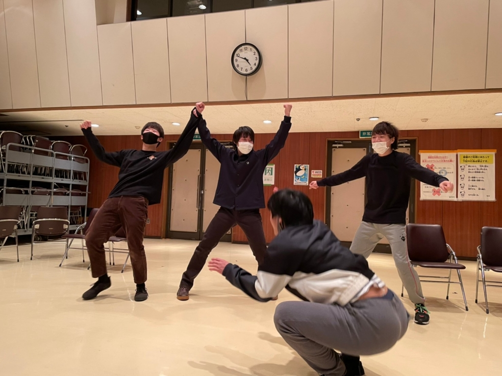

こんにちは、最近コーヒーがないと謎の動悸が止まらない、二回生ナダルです。

　今日は荒通しを行いました。実を言うと今回の台本はどの程度の長さになるのかよく分からない部分があってですね、自分が一人で読んだ時間で今まで計算さていたのですが、いやはや伸びました。
　明暗転もほぼ考慮してない事を考えるともっと伸びるねこれは。役者勢からは「むしろ短く無い？」と言う意見もありましたが前年度の卒で頭がおかしくなってるだけです。

　一回生なんかも今回の舞台には参加してもらっているのですが、良いですね。初々しいフレッシュな演技が見られると、ああこれが万の27期かと感慨深くなります。
　cowcowもジキルも今後の万を引っ張って行ってくれる役者になり得る存在だと思います。彼らの演技にも是非期待していただけると嬉しいです。

　閑話休題。

そんなこんなで、荒通しなのあとなんですけど微妙に時間が余ったんですよ。
　ダメ出しもある程度落ち着いて、休憩って雰囲気でもなくて、かと言ってシーン回しする程の時間は無いわけなんですね？
　けれど、時間を無為に過ごす程自分たちは贅沢を知っているわけでもなくてですね、それでどうしようか、となったわけですが誰かが言ったんです。

『そうだ、ハイテンションエチュードをしよう』

と。

はい、みんな大好きハイテンションエチュードが開催されました。メンバーは私ことナダル、最近情緒が不安定なダリア、稽古始まって以来通算10回の遅刻記録を更新中のハブられメタル、やたら人外に定評のあるキンヨネが選出されました。
結果、荒通しより疲れたとは誰の言葉だったか。

──暫くは、もう、ハイテンションはいいかな。

どんな話だったかは、写真から想像してください。
