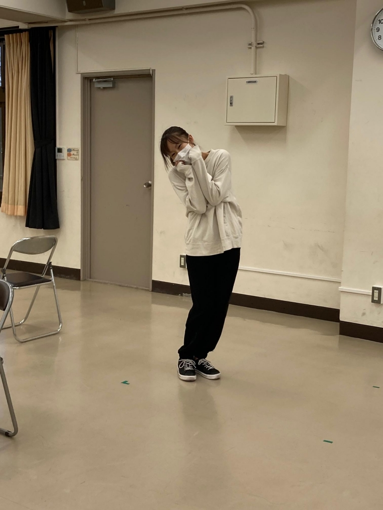

お疲れさまです。書記です。
今回の公演は役者が少ないのでブログが回ってくるのが早いですね～！何を書こうか迷ってるうちにリアルに数時間経ってしまい怖くなってます。

最近少しずつ暖かくなってきて、じわじわと季節が春になっていくのを感じます。もう3回生になるのかと思うとほんとに大学生活って早いなーと思いますね。2回生はコロナのせいもあって何にもできなかったな～～。学校へ行けなくなったり、演劇ができなくなったり大変でしたけど、自粛を強いられたおかげで得られたことや出来たことも多かったなと最近は感じております。嫌なことも辛かったことも、後々振り返ればむしろ良かったと感じられるものだと考えられるように、というか、自然に考えるようになってます。ポジティブ思考が自動化されてるみたいですね。なかなか便利。
どんな結果であれしんどいことは後々活きてくるので、やっぱりしんどい機会は大事にすべきです。

最近みんな座右の銘やら心持ちやらを書くので私も書くかぁってなった結果、結局思ったことをつらつらと書く感じになりました。こんな思考をしていると友達からブラック企業に勤めそうだねとコメントをいただくことが多いです。何とも言えん。それはさておき今日の夜はzoomで稽古です。今日も頑張りまーす&#9996;&#65038;

写真は太宰からファンサをいただいた時のものです。
