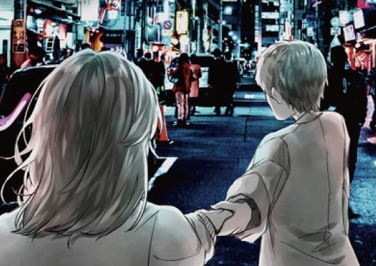

お疲れ様です。ブログ何回目かいまいちよく分からなくなってきました書記です。

長々と稽古期間があったはずの新歓公演もいよいよ最終稽古です。早いですね。
今公演は役者として出させていただいていますが、演出補佐としても携わらせていただきました。といっても、今回の演出はやりたいことが明確でしっかり自分の軸を持っているので、あまり相談することや口を出すことはありませんでした。きっと彼らしい舞台になっていると思います。演出補佐として毎日稽古に来てずっと舞台の前から見てましたが、皆とても成長したと思います。初稽古・初舞台の27期のジキル・かうかうも、突然先輩のいない環境に放り出された26期も必死になって喰らい付いてここまで来ました。コロナのせいで人も減ったし、作業や稽古できる時間もかなり減りました。一人一人が抱える負担も今までと比じゃないくらい増えたと思います。皆自分達が思ってるよりずっとすごいからもっとちゃんと誇って～～って思ってます、最近。みんなよく頑張ってるよ

なんかしんみりしたゃいましたね！！！しんみりするのはなんか違うので元気に行きます！！！！！！！
インソムニアみんなで最後までがんばるのでよろしくおねがいします！！！本番は15日！16日からアーカイブが上がる予定です！！！！！お楽しみに！！！！！！！！！！！

次はいつブログ書くことになるんだろうな～～
