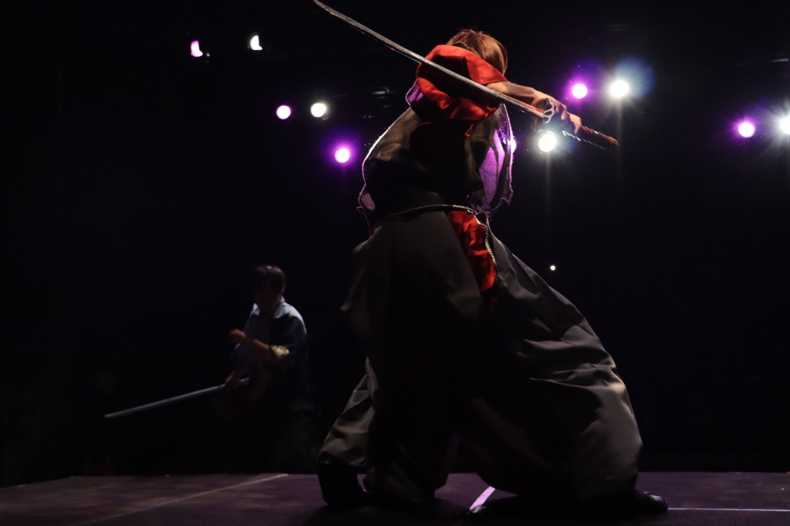

こんにちは、4回生のずかです。前回最後のブログと吐かしておきながらまた筆を取っています。笑う

終演して程よく落ち着いた今、今度は感謝的な意味合いで思いの丈を全て綴ろうと思います。打ち上げとかで直接上手く言う事が出来れば良かったんだけど、どうせなら一言一句ありのまま、後悔無く伝えたいと思いまして。と言い訳しつつ。

受け取ってください。

〇cowcow

ラクステ時のトンデモ爆弾アドリブを多分一生忘れない。この時に限らず、シーン回す度にある種頭ひとつ抜けた演技に圧倒されていました。同心シーン、芸創の雰囲気を支配していたのは間違いなく君だ。役者も殺陣も、これからどんどん研鑽を積んで磨き上げていってください。

〇じょーかー

真摯な子だな、とずっと思っていました。どんな些細な事でも一生懸命耳を傾けてくれる姿、鬼武者から使える技術全部吸収しようという貪欲さを感じました。この公演がこれからの君達にとって目標となってくれたら幸いです。役者してくれてありがとう！新発演出頑張ってね。観に行く日を楽しみにしてます

〇ジキル

アンサンブルの中で1番覇気があったのは君です。さつきからのお墨付きも然り、紛う事無く忖度抜きの実力です。誇ってください。秋の時から感じていましたが、やりたい事への負けん気と挑戦力がすごいね。これからの時間の使い方次第で何者にでもなれると思います。

死ぬ気で頑張れ、愚直さと実力を認めてくれるだけの環境がここにある。 

〇MP

戌丸～～～～！！最後の最後までふわふわかわいかったね。三バカ組にとって欠かせないピースになっていたと思います。選考アンケ「ネタでチキリません」って書いてたの見た瞬間、戌丸を任せる決心がつきました。吹き矢の体勢、毎回綺麗な半身で構えててすごいなあって陰ながら感心してた記憶。今度はバチバチ殺陣もやってみて欲しいなあ、また役者やってくれる日を楽しみにしてます！

〇楓

圧巻、一言に尽きます。ここまで結果を残してくれるとは思ってなかった。

新入生がメインキャストの一角を、芸創小屋支配するレベルにまで仕上げた事実

気づいている人が何人いるか分からないけど

過去卒をさらってみても中々無い偉業です。

先輩達との技術差を地道な努力で埋めていく姿勢はかっこよかったし、尊敬しています。

これからも是非役者を続けてください。鬼武者で得たものが、君の背中を押してくれる日が来ると嬉しいな。

〇キンヨネ

大道具チーフとアンサンブル、引き受けてくれて嬉しかったです。君の熱意とアイデアに救われた局面が幾つもありました。手間のかかる工程、抽象を具象化する苦難、私だけでは絶対成し得ない事です。

あの舞台に私と皆が持ちうる全てを詰め込めた。理想が叶った時、感動で上手く言葉が出なかった。きっと自身で分かっているだろうけど君は凄いやつだ。役者もスタッフワークも残りの時間でやりたい事めいっぱい尽くしてください。ありがとう。

〇はぶ

どうして役者で出してくれなかったんだ～～！！終演後も言い続けるくらいには君を演出したかった。演劇に賭ける熱意と正当な実力、普段はおちゃらけアホの子だけど

見る影も無くなるくらい凛々しく演じる君は立派だぜ。

突然やったのに殺陣指導もしてくれてありがとう。盗み聞きしてたんやけど、筋立てて改善を施すダメだしに感服してました。

さつきの愛弟子として、26期の一員としてこれからも万絵巻で活躍し続けてください。外部公演も頑張ってな

〇花子

忙しい中やのにアンサンブル引き受けてくれてありがとう。君の事もメインキャスト起用したかったな～～という思いがありました。

何を任せるにしても必ず形にして結果に応えてくれる姿は役者・スタッフワーク問わず信頼に足るものだと思います。殿も言ってたけど後者は特に、これ以上無く頼り甲斐のあるものでした。これからもやりたい事をたくさんして、悔いの無い日々を送ってください。また役者としての姿を見れる日を待っています。

〇胡蝶

よくぞここまで頑張ってくれました。努力が実った公演になりましたね。

捻りの無い王道ヒロイン、君の性格から察するに1番苦手分野だったんじゃないでしょうか。推し考察と1括りに定義してしまうと見逃しがちだけど、役の良さを見抜いて人物背景を描く力は目を見張るものがありました。演出業に通ずるものがありますね。たまにBLなってたけど

お淑やかで品格ある柔らかな女の子、誰もにそう思わせるだけの力があった。もう役者として1人前だね。これからもたくさんの役に触れて、君の色んな解釈を観たいです。四葉と向き合ってくれてありがとう。

〇だりや

流石だね、今回もきっちり結果を残してくれたんじゃないかと思います。君に重役を任せて良かった。空き時間でも努力を続ける姿、没入に似た役への努力。過去の足跡があったからこそ今があり、確固たる信頼を置けた。君の描く役者理想値まで背を押したくて、熱意に応えたくて、シーンを回す度にどうすれば互いに納得いくか全力で頭を回してました。もし少しでも鬼武者で得たものを糧に君達の集大成に活かせるのなら心から嬉しい。

最後に君を演出出来て本当に良かった。ありがとう。最高にかっこいいオタクだったぜ

〇太宰晴吾

もう大一番を躊躇いなく任せられる、それだけの実力と安定感があるなと思います。責任感ある姿に頼りきりになってしまった時もありました、本当に成長したね。無邪気さと主体性、聡明さが無ければ葵雉は絶対こなせない。現役生なら太宰にしか演じられないと強く確信して任せました。期待に応えてくれて嬉しかったよ。君は天真爛漫で笑顔が眩しい分、目に見えない所で苦労や悩みを抱え込みすぎないかちょっと心配です。残り約1年、太宰がやりたいと思う道を存分に突き進んでください。君と鬼武者を作れて本当に良かった。

〇真弓

卒期間、主に帰り道でずっと思ってたけどほんとにアホだねえ。どうしたらそんなにイジり所を思いつくのかとこっそり感心してたまである。そんな君だから、ある意味で一貫した生き方を通していたからこそ猿飛を任せるに足ると真っ先に実感したのだと思う。どこかで話した気もするけど、三バカ組はチームワークと熱意、何よりシーンを壊しかねない程の遊び心が必要不可欠で。これらに応えてくれる人は、今回の3人組以外は想像つかなかった。ふざけているようできちんとダメだしと向き合っている姿は頼りがいがあったし、「任せてよかった」と心から思えたよ。ブレーキぶっ壊れアドリブ、私には制御しきれなかったけど。猿飛と向き合い続けてくれてありがとう。

〇撫子

撫子のスタイルが活かされた公演になったんじゃないでしょうか。繊細な悪女役で右に出る人はもう現役生ではいないね、本当にすごい。細かなダメだしや人物背景まで演技に練り込んでくれて嬉しかったな。

貞織は美しさと気丈さ、裏にある脆さが魅力。表裏共に私が思う"美女"を作り上げたいと脚本読んだ時から感じていて。撫子なら安心して任せる事が出来るな、と強く感じたのを覚えています。語頭・語尾一瞬の言い回し、些細な動きまでこだわってくれたからこそ理想の貞織に届いてくれた。死に際綺麗すぎて息を飲んだ。素敵な演技をありがとう、君への演出は最高に楽しかったよ。

〇ナダル

役者として明らかな転換点になりましたね。大っぴらにこそされないけれど、出来ない・苦手と認識されていたものがこの公演で大きく変わったのではと思います。勿論いい意味で。面談の時もそうだったれど、前々からやりたい事への野心がすごい人だなと感じさせられていて。長所を潰すようなダメだしに重い作業量、並の覚悟じゃ絶対こなせない事でしょう。それでも驚く程の結果と変化を持ってきてくれた。期待に応えてくれて嬉しかった。飾らない重厚な感情と轟轟とした動きは間違い無く新たな強みです。圧倒するような演技がこれからも観たいな。阿久津を作り上げてくれてありがとう、君に任せて本当に良かった。

〇書記

感謝してもし尽くしきれない、それほど頼る事が多かったし素敵な後輩だなと感じさせられました。スタッフ作業の傍ら役作りに演出補佐、文字通り大変だった事でしょう。だからこそ全てこなす事が出来た君は本当にすごい。稽古期間、或いはそれより前から何度も何度も話し合いしたね。相談沢山したし、修羅場だって共にした。君の実直なダメだしの姿勢を隣で見てきて信頼に足ると感じたからこそ、心置きなく任せる事が出来た。役作りも最後には芯の通った素敵な弥勒が作り上げられていて驚きました。やると決めた事は本当にこなしてしまう、もう立派な先輩だね。約1ヶ月ちょっと共に走り抜けたのが君で良かった。ありがとう。正真正銘最高の相棒だったよ

〇どらこじ

まじでお疲れ！！！！！！重たい作業全部こなして走りきってくれてありがとう、本当に本当にすごい。当初渡したざっくりイメージプランがここまで凄まじいものになるとは思いもしなかった。前々からどらこじはすごいって皆口を揃えて言っていたけれど、今回で身をもって実感したように思います。いや、元々すごいやつだなあって思っていたけども。私が考えていた事、作り上げたかったもの、本番ギリギリまで汲み取って作り出してくれて感謝しかありません。ほんわかした雰囲気の裏でしっかり考えて行動する在り方に尊敬や信頼を置いている人はきっと多い事でしょう。これからも人生をめいっぱい楽しむ素敵などらこじで在り続けてください。

〇ボスメタ

4年間同期音響として共に過ごしてきたけれど、ここまで苦楽乗り越えてきた人は中々いない。結果主義な在り方、曲がらない考え、ありのままを伝える姿勢。時に傷ついたり衝突を起こした事もあったけど、そんな君だからこそ理想をありのままぶつけられると信じて、絶対に卒音響チーフを任せたいと信頼する事が出来た。脚本読んだ時に「こんなBG欲しいなあ」と想像してたもの以上の結果を出す事が出来たのは、君が音響としての誇りと実力、執念を持っていたからに他ならない。私が知ってる限りで過去公演辿っても間違い無く、今回が1番の出来栄えかつ集大成。BG1曲、SE1つとっても話し合って拘り抜いたし

特に最後のシーン、BGとの相性良すぎて雰囲気に溶け合ってた。君の音響としての誇りに背を預ける思いで走りきりました。最高の仕事をありがとう、お陰で後悔無く全て出し切れたよ。

〇殿

何度も何度も救われて、諭されて、背を押してくれて。苦しい局面にいる時絶対支えてくれたのはお前さんだったな。この4年でどれだけ助けられた事だろう。

脚本を読んで、加太を真っ先に重ねたのが殿だった。茶目っ気溢れる悪戯心と揺らがない決意をこれ以上無く体現してくれたなと思います。元々責任感が強いのは知っていたけれど、シーン1つの雰囲気を担ってしまうくらい頼もしく成長してくれたのは本当に嬉しかった。シーン9は多分墓場に入るまでずっと忘れない気がする。

もう環状線乗って後輩達とお話する事も無くなっちゃうし、京橋うどん会も出来なくなっちゃうな。悲しい

自分の事を大切にしながらも人に対して全力を注いで向き合ってくれる殿だから、こうして卒団まで居続ける事が出来たよ。4年間ありがとう。お前さんはこれからも最高の同期にして親友です。

〇コロ助

お前さんには本当に本当に苦労かけっぱなしだったなあ。私の不甲斐なさで迷惑をかけてしまった事何度もありましたね。卒期間思い返すだけでもそんな感じがする、申し訳ない。いつぞやの時にも言ったけど、私は鬼武者を忖度無しの最高傑作にしたいと決めていて。灯をさつきかコロ助どちらに託そうかと考えた時に、灯の男らしさと茶目っ気、大切な人への情熱、凛々しさ、七史を支える役柄はコロちゃんだからこそ輝くなあと感じて任せました。過去さらってみた時に今までにないような役、その上薙刀もスタッフワークもあるし間違い無く大変だったと思います。けどすごく頼もしい役として舞台を引っ張ってくれていて、心から鬼武者を任せる事が出来ました。ラクステのシーン16、最後列で観てたけど迫力が凄まじくて息を飲んだ。ギリギリまで色んなアレンジや提案を持ってきてくれて嬉しかったよ。これからも真っ直ぐで自分にも他人にも厳しい、どこまでも努力家なコロ助で在り続けてください。かっこよかったぜ、灯のおっさん。

〇ふぇい

打ち上げの時に伝えきれなかった事、ここで全部伝えます。一言一句見逃さんでな。

月宮時雨はこの脚本における悪の象徴、悪がより強大である程正義が映える。つまりどういう事か。ヒーロー物と位置づけていた私の演出において、忖度抜きの実力ある集大成にすると決めていた「鬼武者」において、時雨は七史と同じくらい卒成否の重みを背負っていたという事。絶対生半可なものにしたくないからこそ、贔屓目抜きで1番実力と経験を信頼出来る人に託しました。稽古中「最後まで褒めないで」ってずっと言い続けていた姿が印象的だったな。あの一言があったから、貪欲な姿勢を知っていたから稽古最終日まで私の描く時雨に近づけようと何度も何度もシーン回しして拘り抜く事が出来た。些細な違和感も全てダメだしとしてぶつけまくったと思います。めっちゃ変な話やけど、もし過去万絵巻で活躍された先輩方が同じ役を演じたとしても、きっと成功は収める事が出来たのでしょう。けど鬼武者をここまで連れてきてくれたのは、あの芸創で1番野心を滾らせる事が出来たのはふぇいしかいないって言いきれる。ラクステ最後列で憎悪を浴びた時、「時雨がそこにいる」と震えた瞬間は忘れられない。この日の為にどれだけ心身削ってくれた事だろう。ありがとう、君の努力は私の理想に相応しいものだったよ。

〇さつき

私と演出補佐、同期後輩皆からの信頼を背負った配役。どうだったかな、めいっぱい楽しめた？言わずもがなというか打ち上げの時に伝えたけど、七史はこの物語のヒーロー。現役生全員、そして万絵巻の事を知って下さっているお客さんからの期待を一身に担う事が出来る実力と気概がある人じゃないと絶対嫌って気持ちがあって。選考の時からずっと変わらずさつきじゃないとダメだって思いが奥底にありました。過去何度も主役を担ってきた同期。最後で集大成だからこそ、「ただの主役」だけでは終わらせたくなくて

どうすれば一味違う七史を作り上げられるか、さつきを最大限活かすにはどう演出すべきかずっと考え続けてきました。シーン回しの時納得いくまで疑問をぶつけて来てくれた事、台詞回しに細かな心情プランを練ってきてくれた事、役や殺陣に拘りを詰め込んできてくれた事。本人は口にしないけれど、行動に裏付けされた熱意を感じていたからこそ、培った理想と技術全てを賭けて送り出そうと心から思えた。

ラクステの「足をちぎってでも舞台に立ってやろうと思えた」って一言。あの言葉で私の理想、執念の全てが報われたような気がしました。七史時雨の殺陣、正義と悪の熱量が芸創を支配していた瞬間は宝物です。私達をここまで連れてきてくれてありがとう。さつきが主役で、鬼武者のヒーローで本当に良かった。

┈┈┈┈┈┈┈┈┈┈┈┈┈┈┈┈┈┈┈┈

有無を言わせない集大成を作り上げたくて走り抜けた、怒涛の1ヶ月。素敵な同期や後輩に助けられて余す事無く理想を体現する事が出来ました。最強の座組に恵まれたと心から実感しています。

25期卒公。演出が決まった時、或いはそれよりずっとずっと前から集大成とは別にもう1つ目標がありました。

一足先に卒団された先輩方へ最大限の尊敬と感謝の意を心に留めているからこそ

「全ての過去を超えて1番の公演を作り出そう」と。

万絵巻なら、誇りある25期ならそれが出来ると確信がありました。

私にとって過去公演、特に秋卒は心に残るものであり超えるべき目標だった。

もし後輩達にとって「鬼武者」もまた目標となってくれたのなら心から嬉しい。

来年・再来年、その先もずっと「先輩を超えてやる」という野心を持つ人が演出、そして重役を担って欲しいと個人的に願っています。時にぶつかったりしても奥底では背を預け合う環境が大好きで。歴代卒業公演はきっとそんな熱意が奥底にあったから、否応無しに憧れたのだと思う。

理想に携わってくれたのが君達で本当に良かった。25期にとって鬼武者は、間違い無く集大成。この事を誇りに未来を歩んでいってくれたら幸いです。のめり込むような最期をありがとう。

iPhoneから送信
