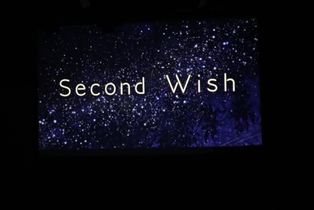

&#65279;先日終演しました。演出だった鬼灯です。
1ヶ月という長い様で短い稽古期間でした。

まさか入学して1年以内に演出になるとは思わなかったです。何故やろうと思ったのかは思い出せませんが，きっと自分の挑戦心が急に燃えたからでしょう。

最初のブログにも書きましたが，ただただ不安でした。もうちっと自分を信用しろよ と言われそうですが，昔から何かを指示したりという事を避けてきた身からすると自信をもって稽古初日は迎えられなかったです。

始まってからも色々ご迷惑かけましたね。
舞台に悩んで1日分の稽古時間を使って役者と演出補佐総動員で舞台図を一緒に考えて頂いたり，
本番2週間前に急にOP追加すると言い出したり，
カテコはお辞儀じゃ物足りないからアフターストーリーっぽく作ってくださいと注文したり。

…うん，並べてみると ちょっと意味が分からない事沢山してますね(ーー;)
もし次演出をする機会があればこうならない様に気を付けます。

でも不安だったなりに 必死に足掻いて、沢山助けられて，無事に本番を迎える事が出来ました。
来てくださった方が演劇に興味をもってくださったかは正直分かりません。
それでも、私は…… ほんの少しでも印象に残っていたら良いなと願っています…☆彡
ご来場くださり誠にありがとうございました。

そして団員の方々，沢山協力してくださり本当にありがとうございました。
ずっと、憶えています。あの光景を。
あの日上演されていたのは，私が思い描いたとおりの『Second Wish』でした。
タイムマシンは無いけれど、過去に戻ってもう1度観てみたい…(^^)

次の公演も頑張ります

それでは皆さん、素敵な週末を
ごきげんよう
