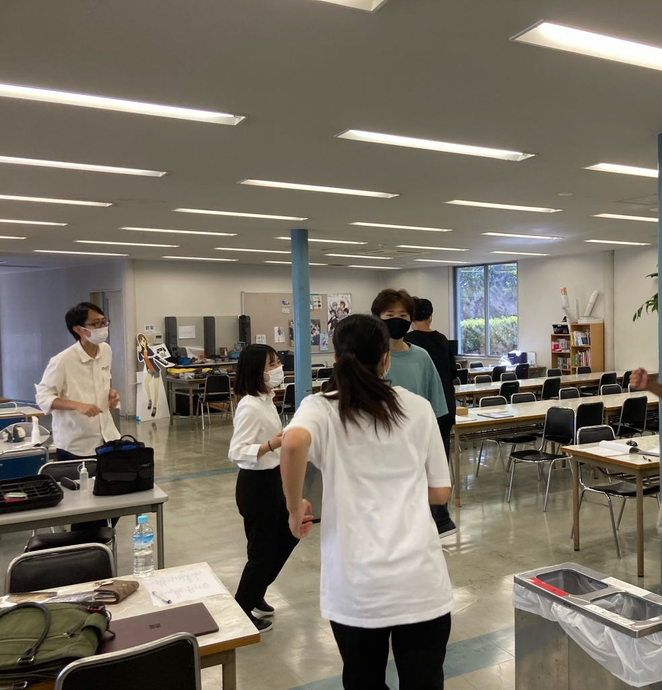

こんにちは。4回生の真弓です。

関わることが出来る公演も、数えるところあと2舞台となりました。来てしまうものなんですね。

さて、演出→舞監→と続いて次は演補かと思いきやまさかのトラップ。ただの制作さんなんですね。チーフでもないですよ。

勿論、序盤にブログを書いているということは役者も兼ねているは兼ねているんですが。

ただ、なんとなくタイトルで察した方もいらっしゃるとは思いますが、今のところ今回の公演には未だ自分の役に自信を持てていません。仕上がるのか不安で仕方がない。１ヶ月期間ですし。実際、昨日は半荒通しを兼ねた長回しだったのですが、掴めない。かといって今までの役が全て掴めたかと言われれば口ごもることにもなりますが。今までとは違って3枚目系ではない(僕的には)、というのもこう思う原因なのかもですね。

役者選考時から今回の選考は倍率も高く、レベルの高さが素人ながらにも伝わってきてはいたのですが、改めて役を割り振って動いてみると顕著に出ますね。スキル型・憑依型・自在型、様々なキャストが自分なりのその「役」の演技を持ち込んでは発揮してを繰り返して伸びていく稽古場になることが早くも予想される、そんな稽古場です。万を演技でも役職でも引っ張る側の4回生、夏を通して腕を上げまくる１回生。その間で奮闘する2、3回生。それらの板挟みで圧倒されてこんな不安を吐露してしまう日々です。

万絵巻型の稽古を経験した方はわかると思うんですが、当劇団のスタイルでは、こういった通しとかの時に演出が舞台の真ん前で見守って演出の後頭部越しにお客様目線で自分たちの動きなどを振り返るといったスタイルで行います。なので、出やすい演出だと後ろ姿でも、「あ、ここ感心してるな～」とか「見入ってるな～」とかが無惨にもわかりやすいんです。正直言うと今回の演出が所謂出やすい人なんです。そこを見るべきではないとわかっていても見てしまうのが自分の性です。んで今回の映像を振り返って見ると「あー首かしげとるな～」、「ちっちゃい声でマジかって言ったな～、今」ってなっちゃったんですよね。考えすぎかもですが。まぁ後で癖とか志向を教えてくれるのもちゃんとセットになってるんですが、とりあえず今んとこはフワッとした言い方で言っても、「このままだとマズイなー」って感じです。

このままじゃ4回生として後輩に合わせる顔が無いですね。どの面さげてアドバイスしてるん？と思われるのではないかとネガティブ思考になってしまいます。(勿論そんな後輩は自脳以外にいませんが)

そんな向き合い方をする公演に今回はなるのかなと思います。3枚目だけじゃダメなんだなーと。今まで見せたことの無いタイプの役者になれたらな～と思います。よくない癖や見たことある演技などを避けれればいいですね。

このネガティブ思考が2周目のブログではどうなってるのかってのもポイントですね。

予約フォームも解放されておりますのでぜひご来場いただけますと幸いです。

⤵︎ ︎⤵︎ ︎⤵︎ ︎

[https://ticket.corich.jp/apply/186083/](https://ticket.corich.jp/apply/186083/)

以下、写真は走ってばっかの役者間からぬっと現れる演出の1枚。

………………………あーーーーーー！！！！！パリーン(心のガラスを割る音)こんな辛気臭いブログ書いてられっか！！！！！！

誰がこんな暗ーいブログで見に行こうって思うんだ！！！！

ブログは！元気の良さと！端的さと！勢い！

演技！何とかする！頑張る！稽古場！行く！めっちゃ通う！キャラ！作る！熟考する！演出！満足させる！させたい！後輩！助言！する！どう思われてようが！知らん！小道具！一旦保留！

スプラ！楽しい！焼肉！おいひい！飼い犬！可愛い！嘘！買ってない！

人生ハッピー！＼(^o^)／感謝！感謝！

以上！！！！！

予約フォームドーン！

[https://ticket.corich.jp/apply/186083/](https://ticket.corich.jp/apply/186083/)

最後に写真ドーン！
