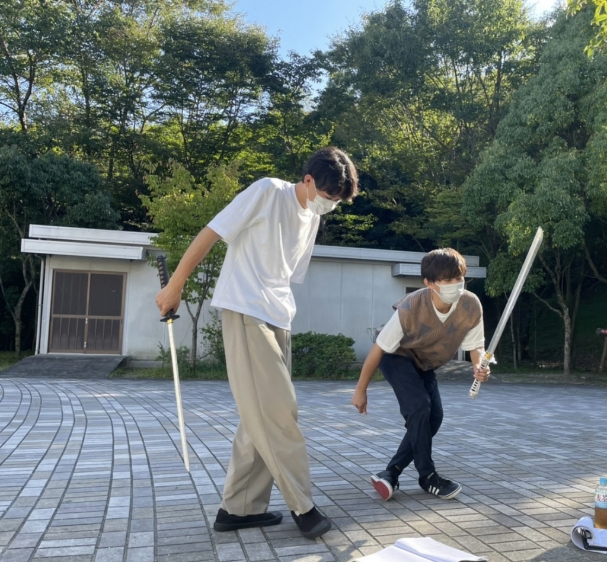

なんか、最近涼しくなったかと思えばまだ暑かったりよく分からない天気ですね～
どうもアドニス・ハヤトです。
ほんなら、僕も名前の由来を話しときますね。
僕はsumicaというバンドが大好きで、その中にアネモネという曲がありまして、そこから派生してアネモネというギリシャ神話に至ったわけです。ほんで、登場人物にアドニスがいましてそこからと、自分の本名のはやとでアドニス・ハヤトとなりました。
なんか下手な文章ですみません。
けどこの芸名は好きです（笑）

さて、今回も役者として舞台に出るんですがなんといっても夏公演よりもレベルが高い。まぁけど短い期間で先輩方から教わったことがいっぱいあるので楽しくやってますねー。

今回は殺陣バチバチやります！忍者刀も使えば苦無も使うし、たまに手裏剣。初めて殺陣をするので分からないことだらけで一つ一つの動きに意味を求めてしまいます。最近分かった事なのですが自分は何かに夢中になった時は一つ一つ細かな所まで納得したい性格なのでしょうね。日常生活は真反対なのですが、、、、
そういった意味では、役者する時においてはリアリストなのかもしれないですねー、(アリスだけに)

自分語りはここまでとしておこう。そんなにおもろくないので

さて、公演まで2週間をきりました。
ストーリーはもちろんのこと、我々役者やスタッフ一同、最高のパフォーマンスができるように全力を尽くします！
是非、見に来て下さいね～
