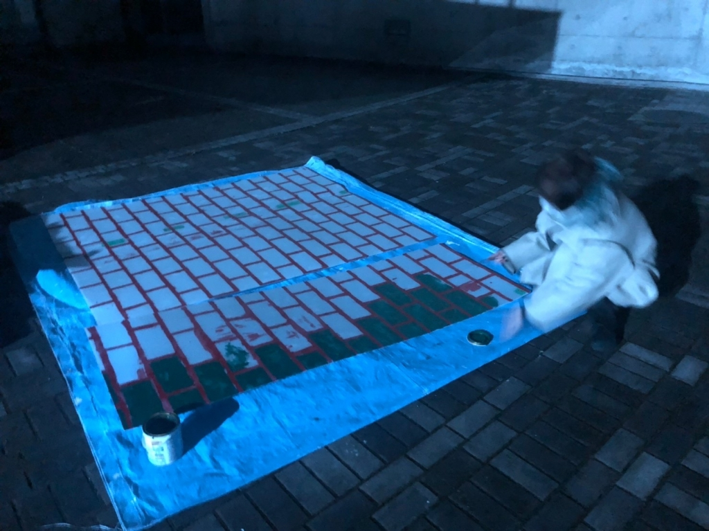

お久しぶりです。書記です。
最後のブログなんですけど、演出から稽古終盤に「26期は適当にもう出しちゃって！！」と言われてしまい、当たり前に作業が詰まっていたので全然書く気が起きませんでした。
やっと作業が終わってブログぼちぼち書くか～って思ったらなんと小屋日なんですよね、演出へ ギリギリでごめんなさい 書記より

さてさてせっかく最後ですし万絵巻での生活を振り返ろうと思います！

……1年ずつ振り返っていたら卒論級の長さになってしまうので一言でまとめます。長かった！！！！！！
コロナで1年活動のない時期があったのにもかかわらずこれだけ長く感じたので、普通にこれまで4年間万絵巻活動をしていた人は本当にすごいと思います。私なら正気を保てません。

人生で1番笑って泣いて、死ぬほど辛いこともあって、めちゃくちゃ楽しい時間もあって、人として足りないところをたくさん教えてもらって、(多分)成長して、得たものがたくさんあって、確実に人生で1番濃い時間でした。おもしろかったな。

いたずらっ子のクラスメイト、改造人間、耳が聞こえない少年、黄色い魔術師の王、忠犬の側近、父となかよしな娘、国語教師、遊女、お天気お姉さん、幼いアリス、そして吸血鬼を万絵巻で演じました。

おばあちゃんとアホ魔法少女をやる予定でしたがコロナのせいでなくなりました。どっちもめっちゃやりたかった。悲しい。

そして2公演演出をやりました。どちらも良いものができたな～と思うんですがやっぱり22年度夏の公演が大好きです。あの真っ白な舞台でやることに意味があったし、衣装も全部良かったし、ブル転が本当に綺麗だった。あとなんか、1年の夏を一緒に過ごしたキンヨネがもう１チームの演出だったのも嬉しかったですね。
舞台自体は私の好みの公演でしかなかったんですが、参加したメンバーがこれから先もっと演劇を好きになるきっかけになっていれば嬉しいです。え、一発ギャグ？触れないでください。

最後に、これまで万絵巻で関わった先輩、そして後輩、同期にたくさん迷惑をかけたしお世話してもらいました。ここまで頑張ってこれたのは間違いなく周りの人のおかげです。本当にありがとうございました。
書記でいられるのもあと数日。最後まで頑張ります。
今公演は、役者と照明チーフと広報チーフと振り付けと舞台美術をちょっとだけしております。
ギリギリまで絵の具まみれになって準備しました、是非26期の卒業公演を目に焼き付けていただきたいです。よろしくお願いいたします。

ではまたいつか！
