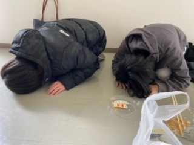

こんにちは。浅葱です。現在近くで照明の作戦会議やってて声が出せないので静かめにしようと思います。まさか2週目当てられるだなんて考えていませんでした。そのせいかネタがないです。悲しいね。

今回役者の他に小道具チーフとして携わらせているのですが、もう大変です。やらなあかん事多い。でもやり甲斐のある役職だなあって思います。

ただ!!!

小道具の作り物の締切が守られる気配がないのは何故でしょう。今回守った奴チーフ含め2人しかいねえ。なんならまだ完成させてない人もいる。ヒラの時はあんま気にして無かったのですが、いざチーフやるとふざけんなってなりますね。これからはちゃんと締切守ろうと思います。てか作り物の締切ってなぜいつも守られないんでしょうか。この疑問を解消してくれる方急募です。

さて稽古の様子です。写真はメジャーバックを忘れた大道具ヒラとそれを悪い事だと思ってない演出です

今何故か殺陣練が始まりました。回し蹴りめっちゃやってます。最近徒手空拳が流行りみたいですね。もぎちゃんがご飯食べた後の運動がうんぬんかんぬん言っています。今回の公演で出番はあるのでしょうか。

ではまたお会いしましょう。

追伸

今日もヨネさんが来ました。新発期間では5回めぐらいでしょうか。なんなら2日前にもきました。演技指導したり、喋ったりしてます。何故彼はこんなに稽古場に来るのでしょうか。この疑問が解消される日は来るのでしょうか。
