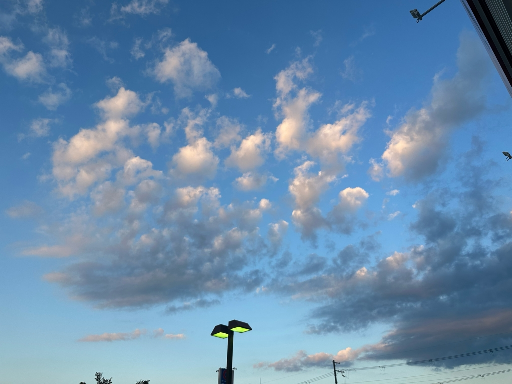

どうもお久しぶりです、にしきです
みなさんいかがお過ごしでしょうか。今年もあと3分の1を切ってるようで寒くなってきましたね。まず初めに、秋公演へのご来場ありがとうございました。新発公演以来の照明チーフを担当いたしました。まだまだ精進しなければいけないと思わされました。でも去年とは違う場所から舞台に参加したのは新鮮な体験でした。
さて、卒公演に向けて少しずつ進んできていますが、相変わらずオンとオフを使い分けるのが難しいです。集中してたらいつの間にか上の空、しっかりしなきゃいけない時にふざけてしまう、自由であるからこそ全ての決定権が自分1人に委ねられていると、僕みたいな人は決まってヤワになってしまうんですね。
この前映画を見まして、洋画に出てくる若者って大学を大人になるための試験場だと思ってて、高校卒業の時点ですでに大人になっているのであって、そうじゃなきゃ無知な子供というレッテルを貼られてしまう。やりたい事、やらなきゃいけない事をはっきり字面として書き出して、それを目標に頑張るのがいいのかなと思います。説教話はこの辺にしといて、、、
そろそろ紅葉シーズンなので、次回ブログを書く機会があれば写真でもあげようかなと思います。
