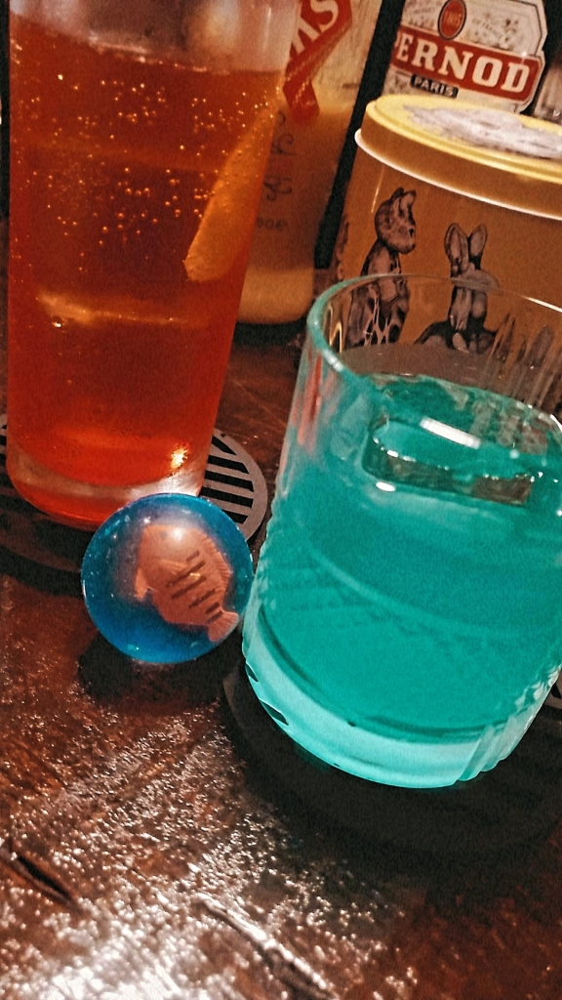

お疲れ様です、消し炭ショコラです！

6月公演とかいうまた万にしては珍しい？初めて？の公演を行っております！高槻キャンパス祭では出来ませんでしたが、今公演では新入生による前座もあるんですよ！今年も大体20人程仮入部してくれてて…有難いことです！新入生のフレッシュさ、是非味わいに来てください！

最近友達とバーに行ってきました～！私が中学の時の塾長がやってると噂だったので夜22時に突撃してきました！積もる話もあって超盛り上がった結果、次の日2限から授業だと言うのに1:30まで話し尽くしました。いやぁ眠い眠い……。途中で「このカクテルに入ってるのは何の味だ選手権」をやったのですけど、私は卵のことをマンゴーと言いました。味覚ってどこで鍛えればいいんでしょう…？ついでに滑舌も鍛えたいのでいっそ誰かと舌を取り替えたいですね。

そんな感じで日々頑張っておりますので、是非皆様ご予約お願いします～！無料公演なので、お気軽に足をお運びください！

↓予約URL

関西大学劇団万絵巻2024年6月公演

『奈落の底には』

作・演出:中原MIK

【日時】

2024年

6月15日(土)

1st : 11:30~

2st : 14:30~

6月16日(日)

3st : 12:00~

※ 受付開始、開場は開演時間の20分前になります。

【あらすじ】

人は死んだらどこへ行くのだろう。みなさんも一度は考えたことがあるのではないだろうか。

ここは、亡くなった人が集うバー『冥界』。そこには複雑なルールと様々な事情を抱えた人々が存在する。そして、ある一人の女性がやって来る。

「いらっしゃいませ、お客様」

これは、生と死の狭間で暮らす者たちの物語。

【会場】

関西大学高槻キャンパス　体育館棟(G棟)G101教室

※ お越しの際はスリッパを持参して頂くようお願いします。会場側でも用意はありますが、数に限りがございますのでご了承ください。

【料金】

無料(カンパ制)

【予約方法】

【スタッフ】

舞合監督：雪月奏花

大道具：シェーレ皐月

小道具：ポイズンマスター

照明：つばき

音響：愛媛みかん

衣装：消し炭ショコラ、ことん

広報：まつり

制作：パステル

【お問い合わせ】

X(旧Twitter)：@Yoroduwemaki

TEL：090-5675-2023（マツダ）

