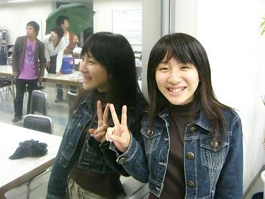

こんばんは！皆様お元気ですか？

さて、いよいよこの日がやってきました。

**仕込み**です。

　「仕込み」とは、言うなれば本番準備。
　大道具さんがセットを組み立てて、照明、音響のセットをし、僕たち待ちに待った**『舞台』**が創られていくのです。
　お客さんである皆さんは残念ながらこの「仕込み」を見ることが出来ないのですが、仕込みには仕込み特有の緊張感があり、それはそれでとても素敵だと、僕は思います。

　それでは、今日はそんな「仕込み」に対する熱い想いを、劇団員に訊いてみました！

「仕込みには、魔物が棲んでる…」(21歳・大学生)

　…だそうです。仕込みには何が待っているか解りません。予期せぬハプニングで怪我でもしたら大変です！こんなコトも有りうるということで、一層気を引き締めなければいけませんね！
　さぁ、気を引き締めて次行ってみましょう！

「仕込みはね、アレっすよ。アレっつーか、マジあんな感じっすよ。もう、何つーか、ホント凄いっすよ！」(20歳・大学生)

　指示詞多すぎですね。日本語不明瞭過ぎですよ。とにかく、凄いということは何となく伝わってきました。
　続いてはコチラ！

「長堀橋駅前の吉野家、なかなか旨いんで、オススメっすよ！」(19歳・大学生)

　**これは最早仕込み関係ないですね！**って言うかお前(19歳・大学生)は僕の話を聞いてたのでしょうか。**仕込めよ！**

…そんなこんなで僕たちの熱い想い(!?)が沢山沢山沢山詰まった劇団万絵巻2006年度秋公演

**WiLL**

**会場で皆様のお越しをお待ちしています！**

今日のWiLL

タイトル「我らが作演！」
仕込みを目前に控えて、満を持して作・演出「ささのは」が登場です！
一回生である彼女が挑むWiLL。
実は、鏡の中のささのはと現実のささのは、二人の指が**WiLL**の**W**になってます。要チェック！
さりげなく映ってしまった(?)後ろのメンバー。
どうして室内で傘を差してるんでしょうね。
