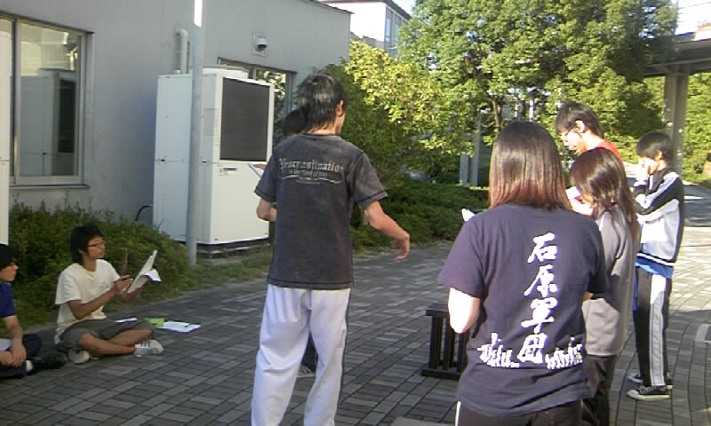

本格的に始動しました卒業公演！
稽古も始まったばかりですが、皆やる気まんまんです！

そんな今日の稽古場では何をしたかというと、

今日は休みでした！！

もう休みかよ～っていう声も聞こえてきそうですが、この休みも大事なんです。
ゆっくりじっくり台本を読み込んだり、気分転換をしたり、休みも大切な時間なんですね。

まぁ、今日は休みだったんで、昨日の稽古場の風景をお伝えしたいと思います。

昨日は高槻キャンパスにて、台本の読み合わせ兼オーディションをしました。
演出さんが見てる前で、役者達は台本片手に演じるんです。

台本を見ながらなんで、たどたどしかったですが、役者達はここぞとばかりに好き勝手しまくりです。

そのせいか、稽古場は笑いの嵐でした(笑)

明日は公園で練習です。
高槻の公園で大声をあげている集団を見掛けたら、それは万絵巻かもしれません。

by 広報
