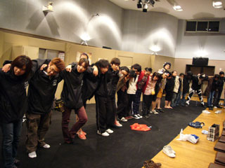
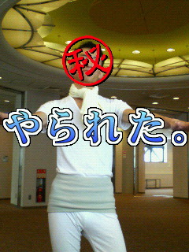

始まりました！
「喉骨のフルート」初日、開幕ですｗ
今日の１９時から１ステージ目が始まり、そして終わりました。
極寒の中、外での作業を頑張ってくれた大道具さん
手を切ってまでも頑張ってくれた小道具さん
１回生をサポートしつつも頑張ってくれた照明さん
客入れの曲など細かいとこまで気配りをしてくれた音響さん
上裸禁止令まで出した衣装さん
全員が徹夜してまで作業という広報さん
公演の裏方を全てになってくれた制作さん
寒さの中頑張って呼び込みをしてくださったスタッフのみなさん
みんなをまとめあげてくれた舞台監督さん
そして、ここまでひっぱてくれた演出さんとみんなの思いをうけついでくれた役者さん

その全てがつまってる今公演。
明後日で終わってしまいますが、走り抜けたいと思います！

喉骨のフルートは明日もやってるよ☆

写真は本番前の円陣です。
万絵巻で最長じゃないでしょうか？？
えらい楕円形になってますｗ

そして最後に今回の万絵巻の幸運のお守り(笑)

きっしょいのはご愛嬌で(笑)

by　広報
