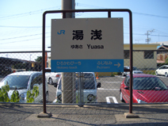
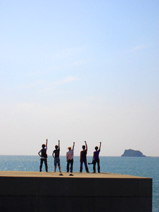
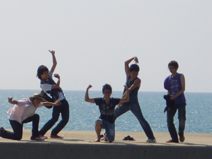
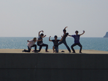

どうも！広報エりんこです、こんばんわ
今日は11人で、作品イメージをつかむため、和歌山の田舎駅にいきました

2～3時間電車に揺られ着いたのはっ

なかなかレトロな町並み。

折角なので海を探して散策☆

海だ～！！
テンション↑↑な演出（笑）

潮風と波の音が心地いい～
のんびり海に癒されるｖｖ

そして男達は誓った･･･

永遠の友情を！！！

実はちょっと淋しくて痛い･･･（笑）

海を満喫して、帰り道。
演出まっさの足元にぼろぼろと藁くずが･･･！
何、電車汚してんねんっ･･･っていうかどっから藁くずがっ!?
よく見るとまっさの可愛い麦わら帽子に穴が

彼女との最後の１枚

解散後、４回生ゆうきさんの服の上で発見された彼女（麦わら）の遺産。

