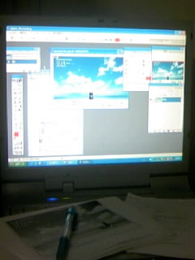

どうも！四回生の田中ゆうきです。

今日の稽古は、演出さんが不在だったため、みんなで自主練習でした。

台本の読み合わせをしたり、各々のキャラや設定について話しあったりしました。
こういった話し合いって大事なんですよね。

「三人寄れば文殊の知恵」と言うように、一人のアイデアが、他のメンバーによって膨らんでいくのは、楽しいですし、刺激になりましたね！！

さて、今公演は役者をやらせてもらう私ですが、実は、広報のお仕事も兼ねさせてもらっているのです。

しかも、担当がビラ作成という、最も多くの人の目につく広報物だったので、とてもドキドキでした。

色んな人に助けてもらいながら、無事、印刷業者さんに入稿できて、ホッとしています。後は、仕上がりを楽しみにして待つだけ♪

今回のお芝居の良さが、ビラから伝われば良いなと思ってます。
