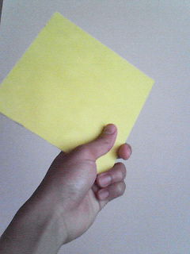

昨日のK-1の魔娑斗のあのダウンからのあの反撃はもうすごかった。彼の不屈の闘志に勇気をもらいました。以前の山本KIDとの試合もすごかったけど今回の試合もいやあ、ほんとすごかった。感服です。あんなにうたれても倒れないとか、日本がね、もう元気がでますよ。いやあ、かっこよかった。

はい。役者のJohnこと守田達也です。

「集中くん」と呼んでいるこの黄色い折り紙でつくった彼が最近もてています。黄色という色は人の集中力を高めてくれるという効果があるとかで。シーンを返す前に役者陣が「集中くん」に群がり彼をただただ見つめ集中力を高めます。奇妙な光景です。本当に効果があるかは、はてなですが、それでテンションが上がるというならば、バカボンのパパ的に言えば「それでいいのだ。」ですね。気持ちです。ちなみに僕が作りました。ちなみに裏面は緑色の折り紙が貼られており「癒しくん」という名前がついていて、彼曰く「僕を見ると目の疲れに効くよ。」です。

集中くんと一緒に今日も稽古！！！
