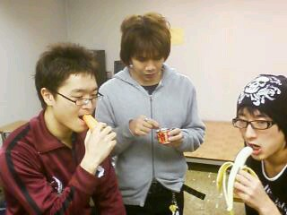

戦はできぬ。戦えぬ。

戦場という命を賭した場でこそ、漢の価値というものは花開く
そして役者は舞台という戦場でのみ、己の価値を体現することができるのだあ！！

というわけで本日の稽古場の写真・・・。

開始前のひと時のキュウソク　
皆おもいおもいの方法で腹ごしらえ、腹ごし・・・

いやまってください　右手の彼、はまだわかります。
バナナですね、はい

中央と左手の二人
手には怪しげな缶詰とニンジンが握られている・・・。

いやね、そりゃ何食べようが勝手ですけどね

ニンジンってどうなん？　

もっとサンドイッチとかあるやんね、そういう奴コンビニで売ってるでしょ。

缶詰て・・・。まあ、おいしいですけどねえ

そんな彼らは万絵巻の未来！
一回生のライス君とクック君でした！
