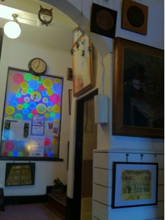

今回のホールとなるフジハラビル。大正時代に建築されたという建物で歴史感漂う場所となっているのですが、決して由緒正しいわけではなく、むしろどこかユーモラスな風合いのほうが強い。

　それはオーナーである藤原さんの戦略ゆえ。この建物の随所に、オーナーの工夫や趣向が隠されているのです。

　 　芸術の秋、とはいいますが、幕間や開演前に早めに訪れて、大阪の不思議なアート空間に身を委ねるのもいいでしょう。

　本番は今日から。１７時から男子チーム、１９時から女子チーム開演。
　ランタイムも１チーム５０分と見やすくなっていますので、今週末は是非南森町へ。

　万絵巻秋公演、お待ちしております。
