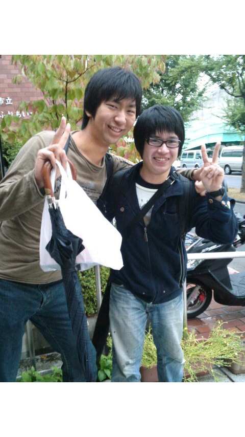

はじめまして～初ブログです！恐縮です！

１回生のもっちです。名前だけでも覚えて帰ってください！

秋公では小道具チーフをさせていただいております！恐縮です！

今日は雨の中、みんな大好きふれあい(小)で稽古でした◎

秋公小屋入りまであと２週間もないです、ひえーこえー

でもあと２週間もないと思うと寂しいですよね(>\_<)

稽古みてると、皆さん試行錯誤でわちゃわちゃめちゃめちゃ頑張ってらっしゃいます！これは私も頑張らねば！

稽古後にブログ命令でたので稽古写真ないです(>\_<)変わりにじゃないですけど解散後の写真です！ええ感じや！

面白いブログ書いて！って言われたけど、下の上ぐらいのことしか書けませんごめんなさい！低空飛行乙！

ではこの辺で！今回ここまでで使ったびっくりマークは13こでした～

ではではさっき駅のエスカレーターに白菜ちぎったのがいっぱい落ちてて超びっくりのもっちでした◎
