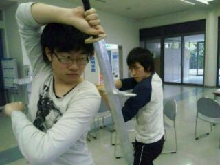

こんばんま！
昨日ブログを更新しようとして寝落ちしたふろむですてへぺろ☆
そんな昨日は、新歓をの打ち入りがありました。
みんなでご飯食べて、しゃべって、
うん、気合いはいったね！
なんせあと三週間、折り返し地点ですよ。
すっかり台詞もはいって段取りも決まった訳で。
もうあとは精度をあげる作業だけ！
がんばっていきまっしょい!!!ヽ(\*´Д｀\*)ノ

さて、そして今日は学校での稽古でした。
いきなり吹雪きだすほどの寒さ！さすが山！ひええ！(>Д<;)
いい加減温かくなってくれないと風邪を引いてしまいます。
みなさんも風邪引かないように気をつけて下さいね。

ということで、今回の写真は、一枚は打ち入り、
もう一枚は殺陣練にほわちゃーしてるゴミさんとしゅうぞうさんでした。
今回の台本は中々色んな要素がつまって一度に何度も美味しい
感じになってますんで、新入生のみなさん楽しみにしてて下さい^^
新入生にかっけー！芝居やべー！って思ってもらえるように、
万絵巻一同頑張っていくんだぜ！いえい！

明日は二回目の通し。
役者は早く寝て、気合いいれて挑みましょう。

そいでは
お疲れさまでしたっ。
