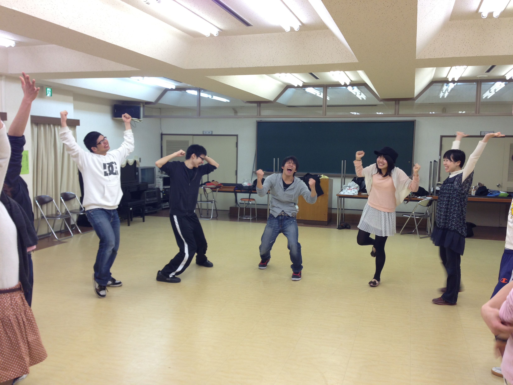

どうも、新歓制作チーフのふぶきです。初チーフです。皆さんどうぞよろしくお願いします。

さてさて無事に始まっております稽古ですが、本日はブレストなるものをやりました。簡単に言えば作品の理解を深める為に関連ワードを発言していくというものです。僕も参加しましたが…これがまた難しい！はい、次までには台本印刷しておきますすみません。

あ、久々に稽古にも加わりましたよ。ええ、ええ。少しは察してください。

でも稽古場はやっぱり楽しいですね！未来の後輩さん達にもこの雰囲気を味わって欲しいですー(＾ω＾)

では今回はこの辺で！写真は感情表現の「喜」。楽しさが伝わるといいなあ。
