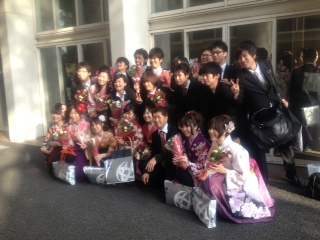

くみちょーです。こんばんわ！
新歓では役者をやらせてもらってます！
万絵巻で役者をするのは4ヶ月ぶりです！
しかも新入生に観られるとなるとドキドキですね(^\_^)☆
去年の新歓公演は演出だったので、それもドキドキしてましたが今回もドキドキです！

新歓稽古の毎日ですが、

先日3月19日に関西大学の卒業式がありました！
もちろん卒業される万絵巻の先輩方を送り出しにいってきました♪

16期生の皆さんご卒業おめでとうございます！

写真は顧問の岡田先生と卒業される皆さんの姿！
女子の袴は素敵～(^○^)！ですね！

さて、卒業生を送り出だしたら次は新しい仲間を迎え入れる番です！
私ももうすぐ三回生か！早いですねぇ！！

というわけで、がんばります(^○^)
では稽古へε=ε=ε=ε=┌(;￣◇￣)┘
