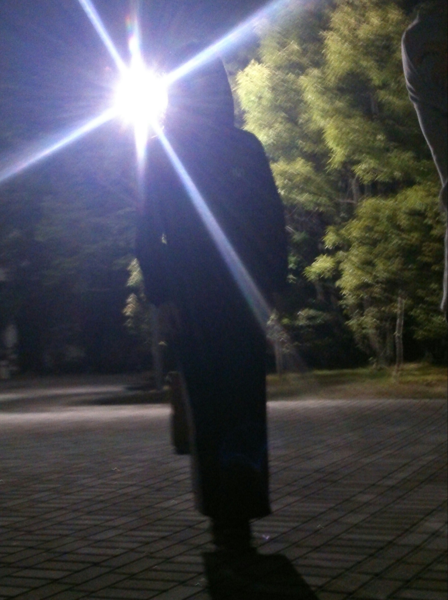

こんばんは、今回のＴＣ祭で音響チーフを任されています茶ぱつです。

初めてのチーフということでドキドキわくわくですが周りに罵られ支えられ罵られて、多目に罵られてなんとか頑張ってます。

ブログになると急にですます調になるんですが気にしないでください。

僕たちの次公演でありますＴＣ祭、本番は26日、10時半～と13時40分～関西大学高槻キャンパスにてあります。
高槻キャンパス？なんぞ？って思った人もいるとおもいますがそういうキャンパスがあるんです。嘘じゃないです。
大阪駅から新快速で15分(からのバスで20分)なので距離はあっても時間はそんなにかかりません。やったね！
お時間ある方は是非どうぞ！
将来有望な一回生のみで作る前座もあるよ！

写真は稽古場の風景です。山の上だから遅くなると真っ暗なんです。
