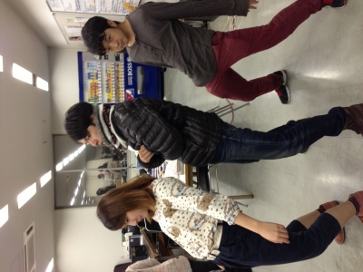

おつかれさまです。

四回生のひのきです。

稽古でダンスしてます。

といっても、まだ基礎連です。

これからガンガンつけて行くのでしょう。

そのダンス基礎連ですが、腰を前後にドンドンパンパン動かしたりしています。

みんなでワイワイいいながらやってます。が、とても変わった光景です。

羞恥心を投げ捨てたダンスの奥深さを感じました。

万絵巻はきっとこれからダンスでいきていくのでしょう。

卒業公演のイチオシポイントです。お楽しみに。

その時の写真が取れなかったので、稽古終わりに再現してくれたのを載せます。

ps オススメのラーメン屋があれば教えてください。美味しいラーメンに飢えています。本当に本当に本当にお願いします。ぜひぜひコメント欄へ！！！

