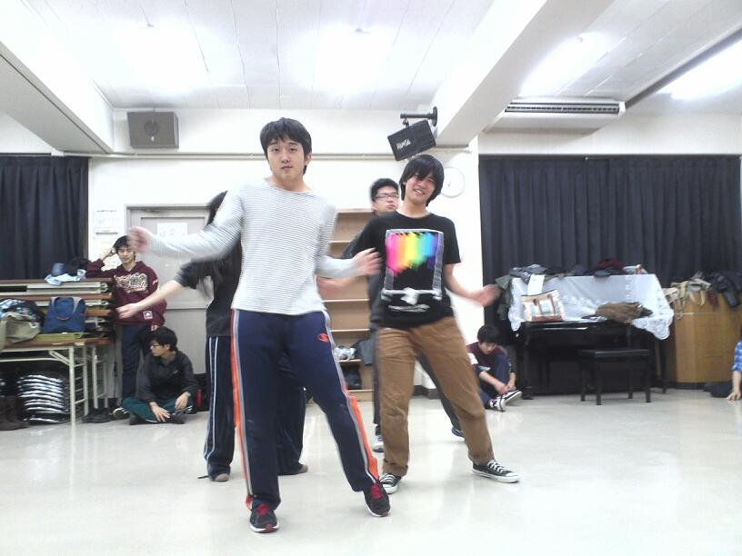

どうもどうも夜分遅くの更新です。

段取りもついて役者もセリフが頭に入ったのか、試行錯誤で楽しいものを作ろうと頑張ってます(^O^)

特に最近は稽古場でのテンションもヒートアップ！ダンス練習もノリノリで体のパーツ分解してます(笑)

その時に使った音楽がウルフルズの「明日があるさ」だったんですよねー。まんなそれに合わせて動く姿はホントに明日があるから気楽に行こうって言ってるサラリーマンの様。

四回生と出来る最後の公演と考えるとやっぱり芝居してるこっちも精一杯楽しみながらやりたいですよね。
そんなこんなで稽古場でテンション爆発させていい作品を作っていきましょう！

というわけで、稽古後に皆で鍋をつつきながらのチャーリーでした！

写真はダンス練の後の休憩時間に曲に合わせて皆で踊ってるところです！
