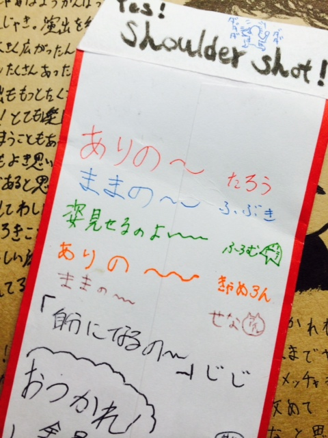

こんばんは、二回生のじじです！
TC演出でした。

2014年度高槻キャンパス祭公演「近江屋」にご来場いただき誠にありがとうございました。

TC期間、本番まで残り30日から始まってあっという間に終わりました。

いや～、めっちゃ楽しかったな～

もちろん、しんどいことも不安なことも多く、
たくさんの人にたくさん辛い思いをさせてしまいました。
でも、最後まで僕のわがままにつき合ってもらって、感謝の気持ちでいっぱいです。

ご来場くださった方にも、
共にこの劇を作ってくれたみんなにも、
「楽しかった、面白かった！」
と言ってもらって
今まで僕がやってきたことは
間違いじゃなかったなって思えました。ほんとに良かったです。

ちょこっとふざけて、笑って
時に話し合って、深めて
またふざけて、笑って
最後に歌って、踊って

そんな稽古場を役者と共に過ごせて
楽しかった！！

熱く赤くハイテンションで！
汗滴るみずみずしさ！

僕が見つけた答えはトマトジュースでした。

じじ六茶
