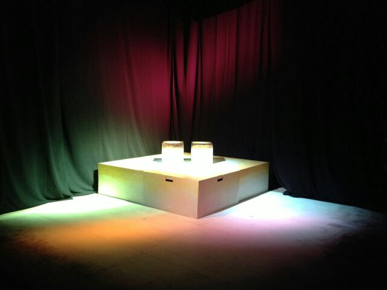

みなさんこんばんは！
今回の秋公演の演出をさせていただいています、三回生のアイルです！

とうとう明日10/18(土)から秋公演本番が始まります。

三回目の演出ともなれば稽古の回しかたやダメ出しの仕方にも慣れただろう～と気楽に始めた今回の秋公演でしたが、やっぱりすごい悩みました！
わたしだけでなく音響さん照明さん、その他衣装やら小道具やらスタッフの方全員、色々な注文をつけてものすごく悩ませてしまったと思います。それでも答えてくださったスタッフさんには本当に頭があがりません。ありがとうございます。

そして役者さんたち。
はじめての稽古から今まで、頼りないわたしを信じてついてきてくださったみなさんに本当に感謝しています。
今回二面舞台などのいろいろな試みを行いましたが、そのどれもに「無理！」と言わず挑戦してくださったみなさんのおかげで、ここまでこれました。
時に明るくふざけて、時にまじめに真剣に、みなさんと過ごせた稽古場はすごく楽しかったです。

もうおんなじ役者さん、スタッフさんですることはないのかーと思うと寂しくて秋公終わらないでって思ってしまいますが、集大成が早く見たいっていう気持ちもあってものすごく複雑です。フクザツ！！！

ですが泣いても笑っても明日は本番一日目！
悔いのないように頑張っていきたいと思います。
みなさん、週末はぜひ天王寺へお越しください！
