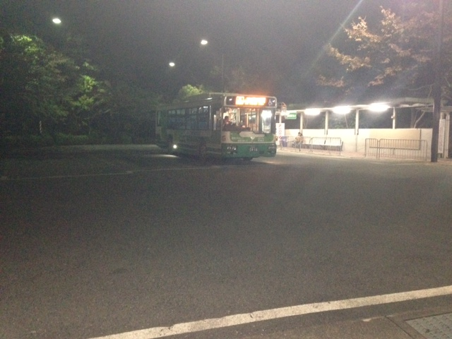

卒業公演演出の鶴山です。

早いもので劇団万絵巻に所属してから四年という月日が経とうとしています。

山の中にポツンとあるこのキャンパスで稽古をするのも最後だと思うと、少し感傷的になってしまいます。

今回の卒業公演の題目は劇想からわまりえっちゃんの青沼リョウスケさんの「わすれらんねぇよ」です。

卒業公演なので、悔いの残らないよう、元気いっぱい、力強い作品を作っていけたらと思っています。

……………………………

………

…

マジメか！！
きもっwwwwww

あ、でもこれ劇団のブログやからちょけすぎたら怒られるから、あかん！

自制しろ！俺！

あーー、下ネタ言いたいよぉ！！！

下ネタをめちゃくちゃ言って、OBから顰蹙買いたいよおおおお。

うおおおおおおおおおお！

ダメだああああ！

きいいいいいいいい！

そんな万絵巻2014卒業公演「忘れらんねぇよ」

是非是非！楽しみにしてください！
