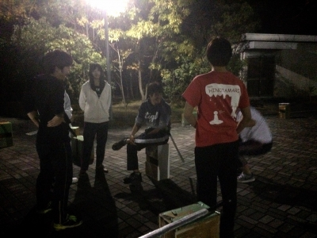

はーい４回生のまさおでーす！

はい、タイトルの再始動なんですけど11/1~4まで関西大学が学園祭をしてたんですね～(￣▽￣)

万絵巻では11/1,2で模擬店をやって、11/3,4では本キャンパスの演劇部、演劇サークルの人たちと合同でやる学学展万というオムニバス公演を行っていました～
今回僕はどちらにも参加できなかったのですが、いや～模擬店、公演に参加していた人たちみんなお疲れさまです～

というわけでこの４日間は稽古は休みとなっていて今日からまた卒公の稽古が始まりました！！

学学展万に参加していたメンバーも合流してこれから一層詰めていきますよ～(￣▽￣)

それでは最後に今日の稽古風景の写真で終わりといたしましょう！
さようなら～(￣▽￣)

関西大学劇団万絵巻2014年度卒業公演
「忘れらんねぇよ」
脚本：青沼リョウスケ
演出：鶴山聖
会場：大阪市立芸術創造館
日時：2014年12月
12（金）18:30～
13（土）14:00～／18:30～
14（日）12:00～／16:30～
料金：学生 前売：800円／当日:1000円
一般 前売：1000円／当日:1200円

あらすじ：
2014年度万絵巻卒業公演は超ウルトラ爆裂ハイテンションエンタメ劇！！

ゲームの世界を舞台に少年たちは、縦横無尽にかけめぐる！

空を見ろ！ 星を見ろ！ 俺たちの卒業する姿を見ろ！

詳しいあらすじはGoogleにて！

ps「忘れらんねぇよ」をよろしく。しょーもないモンにしたら承知しないっぞ☆コテンパンツにしちゃうぞ。期待してます。(青沼リョウスケさんのTwitterにて)

キャスト：
たろう
まさお
ふぶき
ユーリ
ふろむ
仲田くみちょー
画伯
えつこ
きほ
じゅーく
グルメ
高橋キャサリン五世
チャーリー
茶ぱつ
散葉
ともし
出雲大社
うみ
笠井アルゴ
キャメロン
じじ六茶
じょー
すなふきん
やまなクション
らむ
ジミー
はちを
パピー
ほのか
マキ
もっさん
夜王
大和
りん

スタッフ：
舞台監督：ユーリ
舞台監督補佐：ナスカ
大道具：まさお
小道具：アイル
舞台美術：仲田くみちょー
音響：もっち♪♪♪
照明：a---min
衣装：なつの
広報：たろう
制作：ふぶき

問い合わせ：
HP：[http://www.yoroweb.com](http://www.yoroweb.com/)
Twitter：@Yoroduwemaki
MAIL：[information@yoroweb.com](mailto:information@yoroweb.com)
TEL：080-1423-8733（マツモト）
