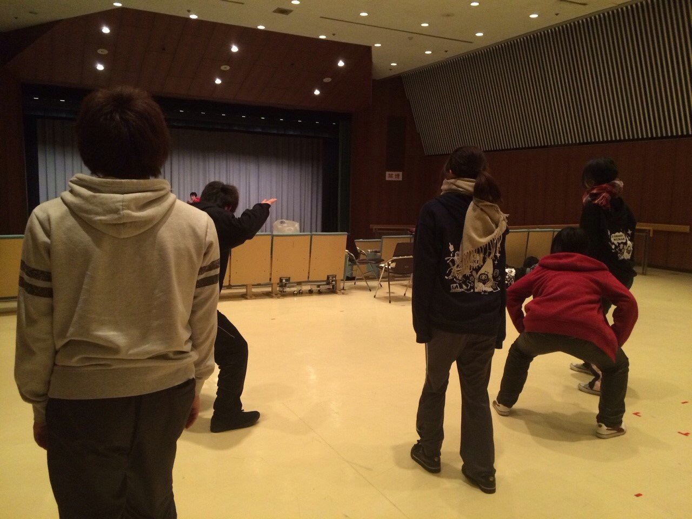

みなさんいかがお過ごしでしょうか？寒くなって外に出るのがつらくても万絵巻は元気ハツラツと稽古に勤しんでおります！！

今日もいつも通り基礎練とシーン回しをしてるなか、10分ほどですがみんなでだるまさんが転んだをやりました(｀・∀・´) 写真はその時の一枚ですw 大学生が全力でだるまさんが転んだをやる姿はまぁ……童心に戻るとはこのことですね笑 

私はこの万絵巻に入ってから今までの公演に役者として出させて頂いてますが、役者って難しいと思う今日この頃です。この役は何を考えどう行動しているのかなど自分の役としっかり向き合おうと思います。今までの公演で先輩方に教わったこと、自分が経験してきたことを生かしてこの新人発表公演をみんなで良いものに作り上げていきたいです！！

私たちの成長をお楽しみに(\*゜v゜\*)

寒くてモコモコのコートやパーカーが手放せないほのかでした！
