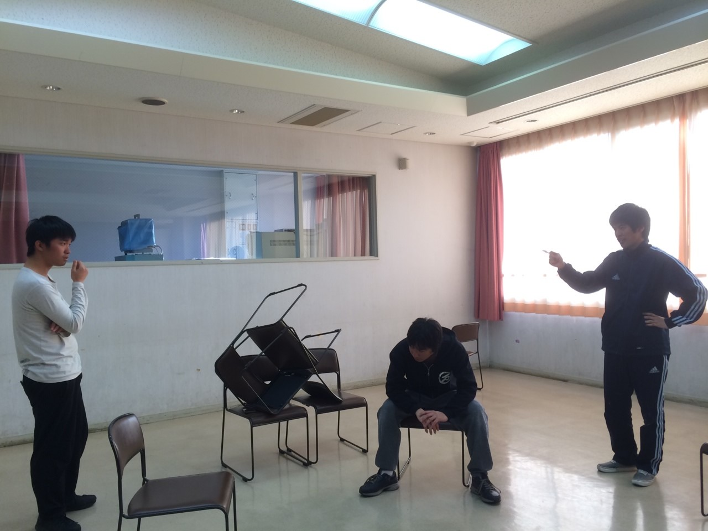

久しぶりのblogです。
万絵巻2回生、出雲です。

目と鼻と喉が痛くなる季節になりました。
花粉症には辛いです(´・c\_・\`)皆さんも体調管理はしっかりと…
さて、月日が立つのは早いものでもう3月。そろそろ大学生活も3年目に入ろうとしています。大学生活も折り返し、来年度はどんな一年になるんでしょうね
(その前に成績発表があるけどね！)
前の稽古では人狼エチュードをしました。人が信じられなくなりますがとりあえずテンションは上がりました。いつもやっていることに「エチュード」とつくと途端に難しく感じます。今後はどんな稽古になっていくのか、楽しみです。

新歓の稽古は始まったばかりですが、万絵巻の良さが滲み出るような公演にしていけたらなと思います。

写真はそんな人狼エチュードです。
