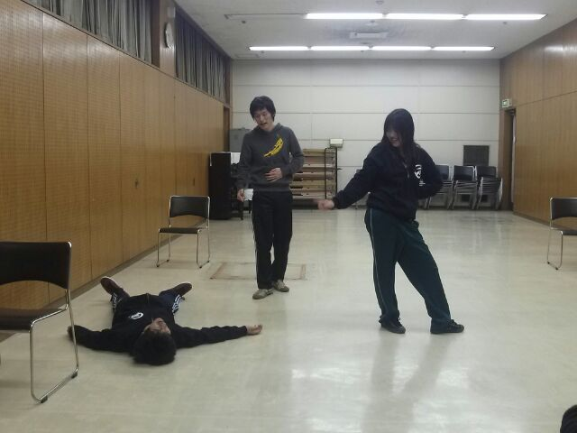

こんにちは
2回生のじょーたろーです

今日の稽古は、１回生が旅行にいってたりしたので、2回生中心にやっていました！！

僕は途中から基礎練に参加しようとしたのですが、急に鼻血が出てきて参加できませんでした。花粉症はつらいです。

10分くらいしたら血が止まったので、基礎練に参加できました。ティッシュ片手
に5人でエチュードをやりました。

お題がランダムな語彙の組み合わせで
決められるので、毎回困惑しながら、
相手と探り合いながら作っていくのが
新鮮で楽しかったです。

久々に同期だけの稽古は遠慮がない独特のノリがあって面白かったです。基礎練も久しぶりにからだを動かして楽しかったです！

僕は今回の公演では、音響のSEオペを担当しています。去年もオペだったので新歓連続できてうれしいです。スタッフとしてを支えていきたいです！！

私事ですが、留年が確定しました。

さようなら。
