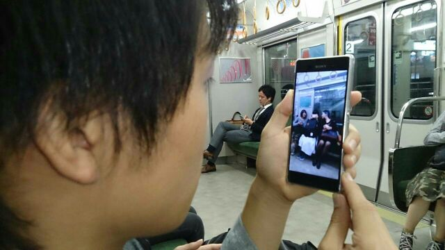

どうも四回生の茶髪です！
最近寒くなってきましたね。冬服出すタイミングを逃してしまっていまだに半袖ででかけてしまうことも多々あります。昼はいいんですけどねー、夜死にます。寒暖差に殺されます。
寒いのは別に嫌いじゃないんですけど、寒かったら布団がね、気持ちよくてね、出れないんですよね。朝。ほんと困ったものです。なんとかしないとと思いながらも、寝る前の決心なんて起きたとき微塵も残ってないんで不思議なものですよね。人間の睡眠欲の前では意思なんてうすっぺらいもんだと自覚する日々です。

さて、今日も今日とて稽古でした。
ダンス練で汗をかきまくった後に飲むアクエリアスはおいしいです。
今回の劇は熱量がすごいのでみんな声がおっきいです。良いことです。シーン回しをするときも一回一回熱いです。激熱です。
これは個人的にずっと思ってたことなんですが、演出のアルゴくんがダメ出しの時に「あー、そこはこうやってもらっていいですか。例えばこう！です。こう！」って言ってるときの「こう！」のタイミングのアルゴが一番輝いてるなーって思います、表情が。楽しいんでしょうね。演出さんが楽しそうでなによりです。

そんな秋公演の稽古場でした。
10月17、18日は天王寺にてお待ちしております！！！

◆関西大学劇団万絵巻2015年度秋公演◆
『FLY AGAIN』 作・演出：アルゴ

【日時】
2015年
10月17日(土)14：30～/19：00～
10月18日(日)13：00～/16：30～
※受付開始、開場は開演時間の30分前になります。

【会場】
OVAL THEATER (オーバルシアター)

地下鉄谷町線「阿倍野駅」１番出口より徒歩2分
JR、地下鉄御堂筋線「天王寺駅」より徒歩6分
近鉄南大阪線「阿部野橋駅」より徒歩5分
阪堺上町線「阿倍野駅」より北へ徒歩1分

URL：http://www.officephi.com/

【料金】
学生前売：500円
一般前売：800円
学生当日：700円
一般当日：1000円
※学生の方は当日学生証をお持ちください。

【予約方法】
こちらのURLからご予約ください。
https://ticket.corich.jp/apply/68545/

写真は稽古帰りの笑顔の練習をしている女子勢を撮っている僕です。犯罪臭がしなくもないですが合法です大丈夫です。
