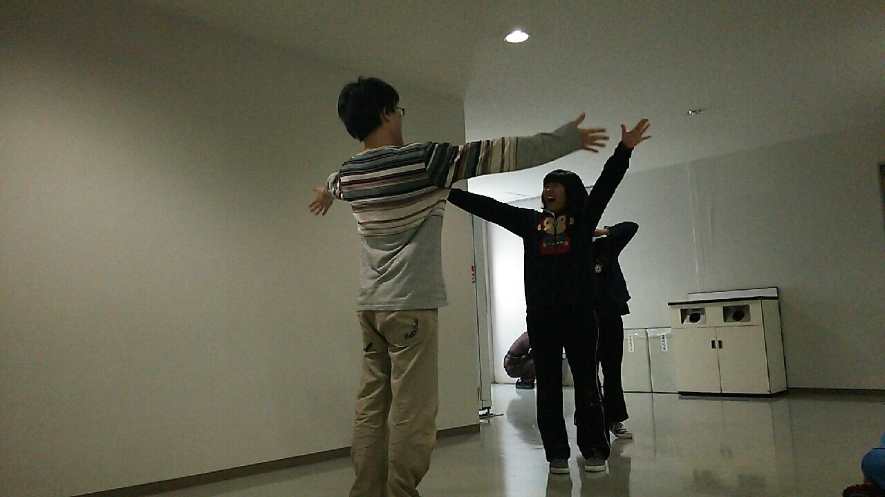

こんばんは。定期入れだけでは飽き足らず筆箱にまでストラップが侵食しつつある光忠です。秋公演では役者と小道具をさせていただくことになりました。

数週前から体調があまりよろしくなかったところを猫アレルギー+秋公演のダブルパンチで見事に喉がやられたまま戻ってきません。[14時](x-apple-data-detectors://0)間ほど籠るだけで回復するなら是非手入れ部屋に直行したい気分です。闇夜に混じる低き唸り声が聞こえたら私かもしれませんね。

なんて冗談はさておき、本日の稽古です。基礎練は僭越ながら私が指揮を取らせていただきました(\*´∀\`\*)夏公以来2度目というのとブランクがあったこともあり少し緊張はありましたがなんとか無事に終えることができて一安心です(๑>ᴗ<๑)

今日のエチュードは3組中2組が告白で締める非常に？ロマンチック？な劇？でした。写真は無事に結ばれた同級生、テーマは「生焼けな心がバーニングハート」。

稽古を水金土日と休んでしまい周りの皆さんからかなり遅れをとっているので、1日でも早くブランクを埋めていきたいです！！とはいえまだ喉が本調子でないので早急に治す方が先ですが……💦 同回生や先輩方にアドバイスを頂くたび、自分の未熟さを思い知らされると共に自分を叱咤するきっかけになります(•́⌄•́๑)૭！

それでは、次回も格好良く決めたいよね( ▼˓◞ ⁼̴̶̤́ )✧
